# Relazione Progetto di Applicazioni Mobili - 2025/2026

**Riccardo Petri (167623)**

## 1. Introduzione

Il presente report descrive l'intero processo di progettazione, sviluppo e valutazione di **Vivo**, un'applicazione mobile sviluppata in Dart utilizzando il framework Flutter. Il progetto affronta una problematica attuale e molto sentita, ossia la salute e il benessere mentale, con lo scopo specifico di aiutare le persone a interrompere i meccanismi dell'ansia e degli attacchi di panico. L'obiettivo dell'applicazione è fornire strumenti e risorse per la gestione dell'ansia, offrendo un supporto pratico e immediato agli utenti. Questo documento illustra la realizzazione dell'applicazione seguendo, passo dopo passo, i principi dello User-Centered Design (UCD), al fine di garantire un'esperienza utente ottimale e soddisfacente.

### 1.1 Organizzazione del report

Questo report è strutturato in diverse sezioni, ciascuna delle quali affronta un aspetto specifico del progetto. Il percorso metodologico è suddiviso in tre step sequenziali:

- **Step 1:** Envisioning. Questa fase è dedicata a definire l'identità dell'applicazione, a posizionarla sul mercato rispetto ai competitor e a delineare e stabilire le priorità dei requisiti principali che rispondono alle esigenze degli utenti target.

- **Step 2:** Prototipazione e valutazione. Questa fase si concentra sull'esplorazione e sulla definizione dell'interfaccia utente (UI), partendo da prototipi a bassa fedeltà disegnati a mano (sketching), fino ad arrivare a prototipi a media fedeltà realizzati con strumenti digitali come Figma (wireframing). Questi ultimi vengono infine sottoposti a valutazioni e test da parte di utenti reali.

- **Step 3:** Sviluppo. Questa fase consiste nella traduzione del design in un'applicazione mobile vera e propria, accompagnata da una valutazione critica delle tecnologie utilizzate e delle variazioni apportate rispetto al prototipo iniziale.

Ai tre step corrispondono i capitoli che seguono. Il capitolo 2 copre il primo step, con il concept statement, l'analisi dei competitor, le personas e i requisiti. I capitoli 3, 4 e 5 coprono il secondo, seguendo l'interfaccia dagli sketch a mano libera ai wireframe digitali fino alla valutazione con gli utenti. Il capitolo 6 copre il terzo, con le tecnologie adottate, le schermate dell'applicazione realizzata e le differenze rispetto al prototipo. Il capitolo 7 conclude il documento con un bilancio del lavoro svolto e propone i possibili sviluppi futuri dell'applicazione.

In sintesi, il presente documento intende dimostrare l'efficacia di un design empatico e mirato. L'obiettivo è evidenziare come un'interfaccia intuitiva possa trasformarsi in uno strumento di supporto concreto, capace di assistere tempestivamente l'utente nella gestione quotidiana dell'ansia e nei momenti di maggiore vulnerabilità.

## 2. Definizione della vision e dei requisiti

In questa sezione vengono delineati i concetti chiave alla base dell'applicazione, la sua vision e i requisiti principali che guidano lo sviluppo del progetto. Inoltre, viene presentata un'analisi dei competitor per comprendere meglio il contesto di mercato e identificare le opportunità di differenziazione.

### 2.1 System concept statement

Vivo è un'applicazione mobile progettata per supportare giovani e adulti che desiderano gestire l'ansia e gli attacchi di panico in modo efficace, con l'intento di disinnescare i meccanismi che li alimentano e tornare a vivere a pieno (da qui la scelta del nome "Vivo"). La società moderna, con le sue costanti pressioni e sfide quotidiane, genera frequentemente livelli significativi di stress, portando molte persone a sentirsi sopraffatte e vulnerabili di fronte alle proprie difficoltà emotive. L'applicazione interviene in queste situazioni offrendo strumenti pratici e un supporto immediato, accessibile in qualsiasi momento. La presenza di un diario personale integrato, inoltre, permette agli utenti di monitorare il proprio percorso di crescita, riflettere sulle esperienze vissute e agevolare la condivisione dei propri stati d'animo con amici, familiari o professionisti. Favorendo una maggiore consapevolezza di sé, l'app si configura come un vero e proprio compagno digitale per la promozione del benessere mentale e della resilienza. L'esperienza utente offerta è intuitiva, rassicurante e user-friendly: attraverso un'interfaccia chiara e ottimizzata, l'utente è facilitato nella navigazione, garantendo un'interazione sicura che lo aiuta ad affrontare le fasi critiche con serenità.

### 2.2 Competitive assessment

In questa sezione viene presentata un'analisi dei competitor, con l'obiettivo di comprendere meglio il contesto di mercato e identificare le opportunità di differenziazione per l'applicazione Vivo. L'analisi si concentra su due applicazioni principali che affrontano tematiche simili, valutando le loro caratteristiche, punti di forza e debolezze.

#### 2.2.1 Rootd

L'esperienza utente di Rootd si apre con una fase di onboarding orientata alla profilazione tramite domande preliminari, sebbene l'applicazione non sembri restituire un chiaro utilizzo di questi dati in termini di personalizzazione del servizio. Fin dalle prime schermate, il sistema evidenzia il supporto dell'Università di Victoria, una scelta progettuale efficace per conferire autorevolezza e credibilità. Il processo è guidato dalla mascotte digitale Ron, un avatar azzurro che tenta di rendere l'interazione più umana ma che fatica a trasmettere un'adeguata sensazione di calma. Il setup iniziale risulta eccessivamente lungo e genera un'evidente barriera per l'utenza europea, in quanto il sistema propone opzioni di accesso legate a cliniche o assicurazioni sanitarie tipicamente statunitensi. Questa fase si conclude con un paywall aggressivo che blocca l'accesso immediato, introducendo un ostacolo strutturale (friction) che penalizza l'accessibilità per chi si trova in una situazione di crisi.

Dal punto di vista dell'architettura visiva, la home page presenta un layout essenziale. Nella sezione superiore è posizionato l'avatar di Ron, affiancato da un indicatore dello stato emotivo. La mascotte funge anche da assistente conversazionale basato su AI, sebbene tale funzionalità sia vincolata alla sottoscrizione di un abbonamento. L'area centrale presenta una serie di pulsanti che consentono di avviare rapidamente diverse attività di supporto. All'interno della barra di navigazione, l'applicazione include una sezione dedicata alle statistiche che permette di visualizzare il tempo trascorso nelle attività, l'avanzamento in specifiche lezioni e un calendario settimanale dell'umore. Questa stessa sezione ospita le impostazioni generali.

L'elemento centrale della barra di navigazione è il pulsante per richiedere aiuto. Nonostante la sua funzione critica, a questo comando è stata attribuita un'errata gerarchia visiva, poiché è stato inserito tra i normali elementi di navigazione e, pur essendo accompagnato da un'etichetta a forma di fumetto con la scritta "Start here", risulta ambiguo e non fa comprendere chiaramente a cosa si riferisca. A questo errore progettuale si somma la scelta del colore rosso, che risulta disfunzionale al contesto d'uso in quanto rischia di indurre un inutile senso di allarme anziché fornire rassicurazione visiva. Oltre ai difetti visivi che rischiano di generare sovraccarico cognitivo in un momento critico, il flusso di soccorso risulta funzionalmente limitato. In caso di attacco di panico, il percorso offre esclusivamente la lettura di frasi di conforto e un audio guidato, omettendo strumenti fondamentali come esercizi di respirazione o tecniche di grounding (pur essendo questi presenti in altre sezioni dell'app). Un'ulteriore criticità di interazione riguarda il tracciamento dei dati. L'utente non ha la possibilità di registrare il proprio stato emotivo e i relativi inneschi durante la richiesta di aiuto, ma può farlo esclusivamente nei momenti di calma, perdendo così l'opportunità di contestualizzare lo stato d'animo legato all'attacco.

  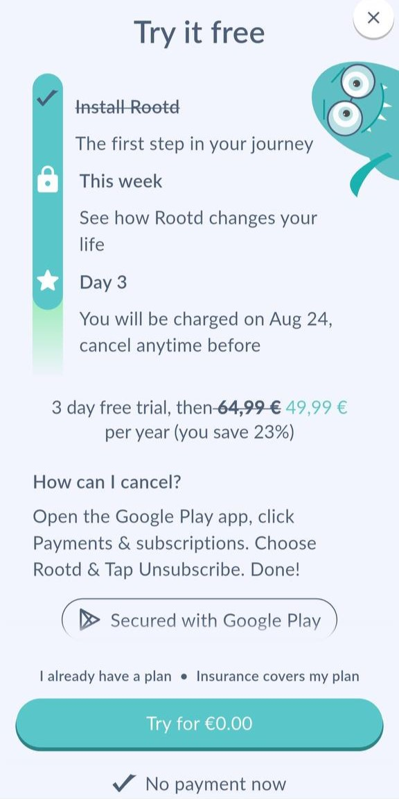
  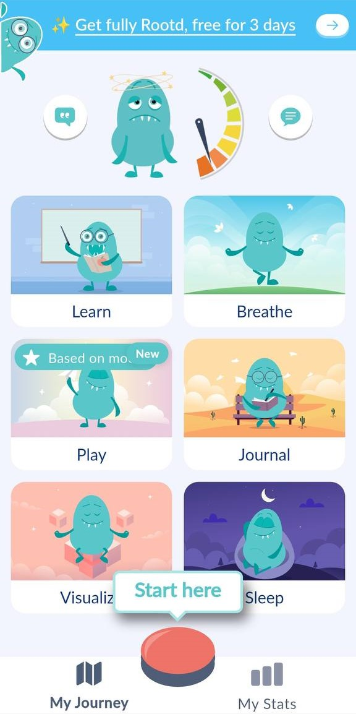
  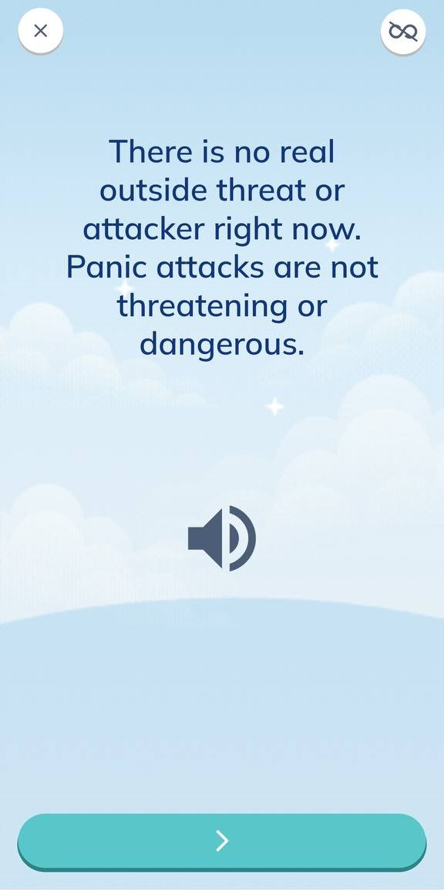

<em>Figura 1 - Rootd: il paywall che chiude l'onboarding, la schermata principale e il percorso di richiesta di aiuto</em>

#### 2.2.2 Dare

L'esperienza utente di Dare si apre con un processo di onboarding decisamente meno invasivo rispetto a Rootd. L'utente ha infatti la possibilità di saltare la profilazione iniziale e accedere direttamente alla home page. Tuttavia, superata questa fase, l'interfaccia si presenta fin da subito affetta da criticità legate all'architettura dell'informazione. La schermata principale ospita una griglia di pulsanti relativi a diverse problematiche come ansia, attacchi di panico e insonnia. Questi elementi risultano aggregati senza un chiaro criterio di categorizzazione. All'interno di questo stesso gruppo è inserito un pulsante di SOS di colore rosso che perde di efficacia visiva fondendosi nel layout generale senza il necessario isolamento spaziale.

Dal punto di vista dell'architettura visiva, la barra di navigazione inferiore si articola in cinque macro aree: la home, la sezione relax, il pulsante di emergenza, le sfide giornaliere e la gestione del profilo. La presenza di un comando di SOS dedicato all'interno di questa barra genera una ridondanza funzionale rispetto all'analogo pulsante inserito nella schermata principale. Inoltre, analogamente a quanto osservato nel competitor precedente, il flusso di soccorso risulta funzionalmente limitato. Il percorso di emergenza offre esclusivamente audio guidati e frasi di conforto, omettendo totalmente strumenti pratici e interattivi per la gestione attiva dell'attacco di panico.

L'esplorazione verticale della home page evidenzia un notevole sovraccarico cognitivo. La pagina è infatti saturata con contenuti eterogenei e disconnessi tra loro, come storie di successo, frasi ispirazionali, webinar e dinamiche social. Questa frammentazione genera un layout destrutturato che rende l'esperienza d'uso poco intuitiva e ostacola la reperibilità delle informazioni persino in situazioni di totale calma emotiva. A questo rumore visivo si aggiungono barriere di navigazione legate alla registrazione e alla monetizzazione. Un banner permanente che invita all'attivazione del free trial è ancorato in modo invasivo appena sopra la barra di navigazione, mentre l'accesso all'assistente conversazionale basato su AI e a molte attività della sezione relax risulta bloccato agli utenti non registrati.

  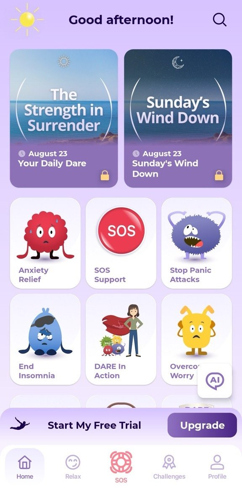
  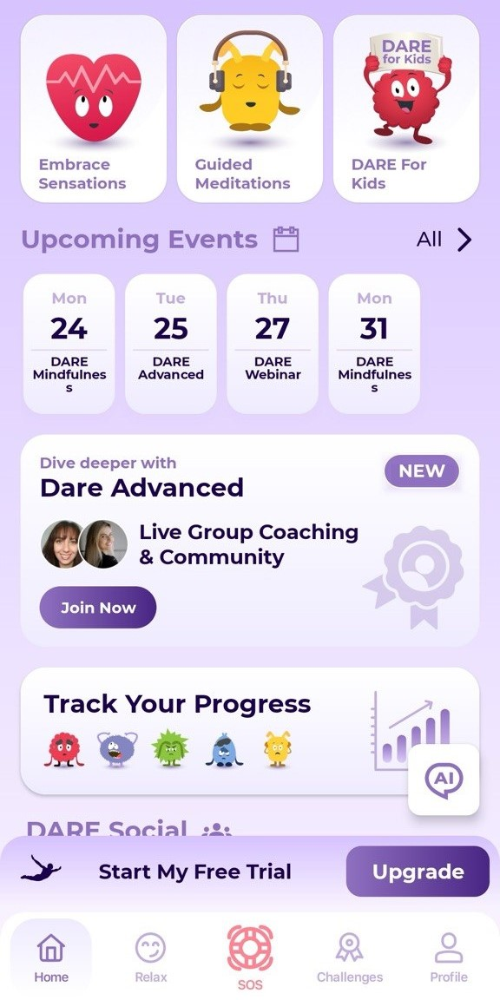
  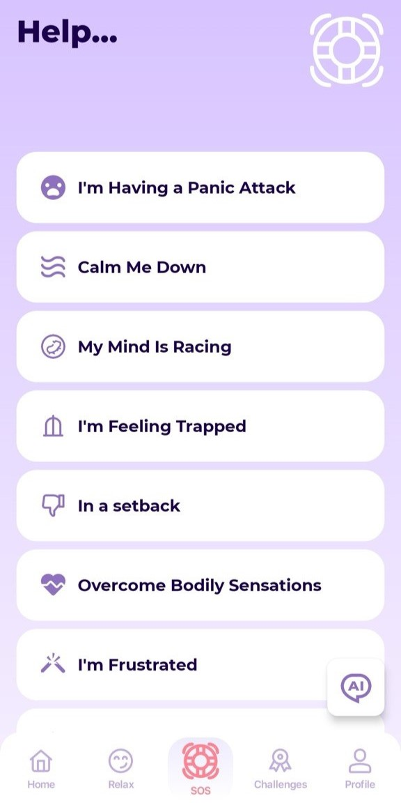

<em>Figura 2 - Dare: la schermata principale, la stessa pagina scorsa verso il basso e il percorso di emergenza</em>

#### 2.2.3 Sintesi comparativa e posizionamento strategico

I risultati dell'analisi competitiva sono stati sintetizzati nella tabella seguente, che mette a confronto le due applicazioni esaminate con la proposta di Vivo. I criteri scelti non sono valutazioni complessive ma fatti osservabili nelle schermate riportate sopra, cosicché il confronto resti verificabile da chi legge e non richieda di fidarsi del giudizio di chi scrive. Le righe individuano insieme le carenze del mercato e i punti su cui il progetto si differenzia.

| Criterio di confronto | Rootd | Dare | Vivo |
| --- | --- | --- | --- |
| Accesso agli strumenti al primo avvio | Onboarding lungo seguito da paywall | Onboarding saltabile | Immediato |
| Registrazione richiesta | Sì | Per una parte delle funzioni | No |
| Esercizi attivi nel percorso di emergenza | Assenti, solo frasi di conforto e audio guidato | Assenti, solo frasi di conforto e audio guidato | Respirazione guidata, distrazione cognitiva e grounding |
| Collocazione del comando di emergenza | Nella barra di navigazione, fra gli altri elementi | Duplicato fra schermata principale e barra di navigazione | Unico, nella schermata principale |
| Carico informativo della schermata principale | Contenuto, con elementi di lettura ambigua | Elevato, contenuti eterogenei in sequenza | Ridotto al minimo |
| Registrazione dello stato emotivo | Solo a freddo, slegata dall'episodio | Solo a freddo, slegata dall'episodio | Contestuale, al termine della crisi |
| Conservazione dei dati | Account con sincronizzazione remota | Account con sincronizzazione remota | Solo sul dispositivo |
| Modello di business | Freemium, con paywall bloccante | Freemium, con banner permanente | Gratuito, senza pubblicità |

Le righe della tabella si lasciano raggruppare in tre lacune, che sono poi i tre punti su cui il progetto si costruisce.

**Il soccorso è passivo.** Entrambe le applicazioni rispondono al momento della crisi con qualcosa da leggere o da ascoltare, ovvero frasi di conforto e audio guidati, e collocano altrove gli esercizi che agirebbero sul corpo e sull'attenzione. Chi apre l'applicazione durante un attacco di panico riceve così un contenuto da seguire con la mente proprio quando la mente è meno disponibile. Vivo colloca al centro del percorso di emergenza tre attività da fare, non da leggere.

**L'aiuto sta dietro una barriera.** Il primo avvio di Rootd chiede una profilazione lunga e si chiude con un paywall, mentre Dare consente di saltare l'onboarding ma riserva agli utenti registrati una parte delle funzioni. In entrambi i casi l'ostacolo si presenta nel punto in cui la persona ha bisogno di aiuto immediato, e un ostacolo in quel punto equivale all'assenza dello strumento. Vivo rende raggiungibile il percorso di soccorso al primo avvio, senza account e senza pagamenti.

**Il tracciamento è scollegato dall'episodio.** In nessuna delle due applicazioni è possibile registrare lo stato emotivo e la causa scatenante nel momento in cui la crisi si conclude, e la registrazione resta confinata ai momenti di calma. Il risultato è un archivio che dice come è andata la giornata ma non che cosa è successo durante l'attacco. Vivo chiude ogni sessione con un questionario breve e riporta quanto raccolto nella giornata corrispondente del diario.

A queste si aggiunge una differenza di impostazione più che di funzione, poiché i contenuti dei competitor vivono su un account sincronizzato con un servizio remoto, mentre in Vivo restano sul dispositivo e non vengono scambiati con nulla.

### 2.3 Personas

L'analisi dei competitor ha messo in luce quali bisogni il mercato lascia scoperti, ma non dice ancora chi sia la persona che li prova. Sono stati perciò definiti due profili utente, ciascuno dei quali raccoglie in una figura verosimile un modo ricorrente di incontrare l'applicazione. I due profili non sono intercambiabili. Il primo incontra Vivo nel momento della crisi e ne mette alla prova l'immediatezza, il secondo lo utilizza nei giorni in cui sta bene e ne mette alla prova la capacità di restituire un andamento leggibile nel tempo. Mantenere presenti entrambe le figure durante la progettazione evita che l'applicazione si sbilanci verso una sola di esse, riducendosi a un pulsante di emergenza privo di memoria oppure a un diario che nel momento dell'attacco non offre alcun aiuto.

**Persona 1: Giulia Rossi**

| Campo | Descrizione |
| --- | --- |
| Età | 21 anni |
| Occupazione | Studentessa universitaria fuorisede, iscritta al secondo anno |
| Contesto | I primi attacchi di panico sono comparsi durante la sessione invernale e oggi si ripresentano in situazioni difficili da prevedere, in aula affollata o sui mezzi pubblici |
| Percorso di cura | Nessuno, non ne ha parlato con uno specialista perché non ritiene il proprio caso abbastanza serio |
| Rapporto con la tecnologia | Elevato, tiene lo smartphone sempre a portata di mano e ha già scaricato e disinstallato due applicazioni del settore |
| Obiettivi | Uscire dalla crisi mentre questa è ancora in corso, ricevendo un'indicazione operativa su cosa fare e non una frase di conforto da leggere. Raggiungere lo strumento in pochi secondi e poterlo usare in luoghi pubblici senza dare nell'occhio. Riconoscere, a crisi conclusa, che cosa l'abbia scatenata, senza compilare moduli lunghi |
| Frustrazioni | Procedure di onboarding estese e domande di profilazione poste prima di poter usare l'applicazione. Registrazione obbligatoria per accedere agli strumenti di emergenza. Paywall collocato proprio sulla funzione di cui avrebbe avuto bisogno |

**Persona 2: Marco Bianchi**

| Campo | Descrizione |
| --- | --- |
| Età | 38 anni |
| Occupazione | Impiegato amministrativo, lavora a tempo pieno |
| Contesto | Convive con un disturbo d'ansia da diversi anni e attraversa periodi in cui gli attacchi si concentrano in poche settimane, seguiti da mesi più tranquilli |
| Percorso di cura | Segue un percorso psicoterapeutico con incontri ogni due settimane |
| Rapporto con la tecnologia | Medio, usa poche applicazioni ma con costanza, e diffida di quelle che richiedono di affidare i propri dati a un servizio esterno |
| Obiettivi | Annotare che cosa accade durante e dopo un attacco, per poterlo riferire con precisione nella seduta successiva. Osservare l'andamento del proprio stato nel tempo e capire se il periodo in corso sia migliore o peggiore del precedente. Praticare gli esercizi di respirazione e di grounding anche nei momenti di calma, per averne padronanza quando serviranno davvero. Mettere per iscritto quello che prova, senza doverlo far rientrare in una scala di valori prestabilita |
| Frustrazioni | Ricostruire a memoria, giorni dopo, un episodio di cui sul momento aveva chiare tutte le circostanze. Dati intimi conservati su server esterni, dei quali non conosce la destinazione. Riepiloghi che si limitano a elencare le registrazioni passate senza indicare alcuna tendenza. Dimenticare di annotare la giornata proprio nei periodi in cui il tracciamento sarebbe più utile |

### 2.4 Requirements brief e prioritizzazione

Sulla base della vision, delle opportunità individuate nell'analisi dei competitor e dei bisogni delle due personas appena descritte sono stati definiti i requisiti del sistema. Ciascuno di essi è formulato come qualcosa che l'utente può fare con l'applicazione, e non come un componente da costruire, poiché un elenco di componenti non dice nulla su ciò che la persona ottiene e rende impossibile stabilire se il requisito sia stato soddisfatto. A ogni requisito è associato un livello di priorità, stabilito in base al suo impatto sulla User Experience e alla sua rilevanza rispetto all'obiettivo principale di offrire un supporto immediato ed efficace nella gestione dell'ansia e degli attacchi di panico.

#### 2.4.1 Must-have requirements

- **REQ-01: Capire a colpo d'occhio che cosa fare in ogni schermata.** L'utente può individuare l'azione principale di una schermata senza leggere istruzioni e senza dover scegliere fra elementi visivamente equivalenti, poiché ogni schermata espone un solo comando dominante e nessun contenuto estraneo al proprio scopo. A questo requisito è assegnata una priorità alta poiché in momenti di forte vulnerabilità emotiva o durante un attacco di panico un'interfaccia complessa o caotica genera un immediato sovraccarico cognitivo che ostacola l'accesso agli strumenti di soccorso.

- **REQ-02: Fare qualcosa durante la crisi, non soltanto leggere.** L'utente può svolgere, mentre l'attacco è in corso, esercizi guidati che agiscono sul respiro con la tecnica 4-4-4-4, sull'attenzione con un'attività di distrazione cognitiva e sui sensi con la tecnica di grounding. La priorità è alta in quanto questi strumenti rappresentano il fulcro funzionale di Vivo. Questo requisito colma la principale lacuna dei competitor, superando l'inefficacia della sola lettura di frasi di conforto.

- **REQ-03: Uscire da qualsiasi percorso sapendo che cosa comporta.** L'utente può interrompere in ogni momento un'attività o una schermata e tornare alla schermata principale, e prima che l'abbandono avvenga il sistema gli dichiara le conseguenze della scelta, in particolare quando interrompere un percorso significa non conservarne il contenuto. Fanno eccezione le brevi schermate di passaggio, che non trattengono l'utente perché si esauriscono da sole dopo pochi secondi e possono essere accelerate con un tocco. La priorità è alta poiché durante una crisi d'ansia la percezione di sentirsi bloccati in un flusso irreversibile genera disorientamento e profonda frustrazione, rischiando di alimentare ulteriormente lo stato di panico.

- **REQ-04: Raggiungere gli strumenti di emergenza fin dal primo avvio.** L'utente può arrivare al percorso di aiuto senza creare un account, senza completare una procedura di configurazione iniziale e senza superare alcun pagamento. Questo requisito ha una priorità alta poiché, come emerso dall'analisi dei competitor, i registration wall e i setup prolungati rappresentano ostacoli critici (friction) che impediscono un intervento tempestivo nel momento del bisogno.

- **REQ-05: Sapere che i propri contenuti restano sul telefono e poterli cancellare.** L'utente può registrare dati anagrafici, riflessioni e storico delle crisi con la garanzia che nulla venga trasmesso verso server esterni, e chi ha creato un profilo può eliminare l'intero archivio in qualsiasi momento. A chi sceglie di usare l'applicazione come ospite, e quindi non ha un profilo da eliminare, resta la disinstallazione, che cancella ugualmente ogni contenuto. La priorità è alta poiché il materiale raccolto è tra i più intimi che una persona possa affidare a un'applicazione, e il solo sospetto che quei contenuti possano essere letti altrove indurrebbe l'utente a censurarsi proprio nei momenti in cui la scrittura sincera ha maggiore valore terapeutico.

#### 2.4.2 Should-have requirements

- **REQ-06: Registrare come sta e che cosa ha scatenato l'attacco.** L'utente può segnare il proprio stato d'animo giornaliero e, al termine di una sessione di aiuto, dichiarare l'intensità dell'attacco appena affrontato e il fattore che lo ha innescato. La priorità è media, poiché si tratta di una funzione che non interviene nell'emergenza immediata, ma risulta fondamentale nel medio periodo per aiutare l'utente a sviluppare consapevolezza emotiva e prevenire crisi future.

- **REQ-07: Rileggere le proprie giornate passate.** L'utente può consultare lo storico e ritrovare, per ciascun giorno, l'umore registrato, le richieste di aiuto con l'orario, l'intensità e il fattore scatenante di ciascuna, e la riflessione scritta. La priorità è media poiché questa funzione consente all'utente di riflettere sul proprio percorso di crescita, monitorare l'evoluzione dell'ansia tra una crisi e l'altra e avere un quadro chiaro da consultare in autonomia.

- **REQ-08: Praticare un esercizio anche quando sta bene.** L'utente può avviare singolarmente la respirazione guidata e il grounding, in un momento qualsiasi e senza attivare l'intero percorso di soccorso. La priorità è media poiché questa possibilità sposta gli strumenti dal solo momento della crisi alla quotidianità, permettendo di gestire gli stati di ansia lieve o anticipatoria e di prendere confidenza con le tecniche in un momento di calma: un esercizio già praticato si esegue con maggiore facilità quando le capacità cognitive sono ridotte dal panico.

- **REQ-09: Vedere se la settimana è andata meglio della precedente.** L'utente può leggere, senza doverlo calcolare, quante volte ha chiesto aiuto nella settimana corrente, quante nella settimana precedente e di quanto il dato sia cambiato. La priorità è media poiché questa sintesi non incide sulla gestione dell'emergenza, ma trasforma una sequenza di registrazioni isolate in un andamento leggibile a colpo d'occhio, restituendo all'utente la percezione concreta del proprio miglioramento e sostenendo la motivazione a proseguire il percorso.

- **REQ-10: Scrivere liberamente ciò che prova.** L'utente può annotare un testo senza vincoli di formato, di lunghezza o di argomento, legato al singolo giorno, e può riaprirlo e modificarlo anche in un momento successivo. La priorità è media poiché la scrittura non interviene durante l'attacco, quando articolare un pensiero è già di per sé faticoso, ma nelle ore che lo seguono consente di dare un nome a ciò che si è provato: mettere in parole un'esperienza confusa la rende più maneggiabile e, a differenza di un valore scelto da una scala predefinita, non costringe il vissuto dell'utente entro categorie stabilite da altri.

- **REQ-11: Avere un profilo personale e tenerne aggiornati i dati.** L'utente può creare un profilo con nome, cognome, indirizzo di posta elettronica, data di nascita, genere e immagine, correggere in seguito ciascuna di queste informazioni, cambiare la propria password e disconnettersi dal dispositivo. La priorità è media poiché l'applicazione resta pienamente utilizzabile anche senza profilo, come stabilito dal requisito di accesso senza barriere (**REQ-04**), ma chi sceglie di crearne uno le affida dei dati che devono restare correggibili senza ricominciare da capo, mentre la disconnessione e il cambio della password sono ciò che permette di tenere il diario al riparo su un telefono che capita di lasciare in mano ad altri.

#### 2.4.3 Could-have requirements

- **REQ-12: Farsi ricordare di annotare la giornata.** L'utente può attivare una notifica ricorrente a un orario stabilito da lui, che lo invita a registrare l'umore e la riflessione del giorno, e può disattivarla in qualsiasi momento. La priorità è bassa poiché si tratta di una funzione di contorno che non interviene nell'emergenza, ma che sostiene nel tempo la regolarità del tracciamento emotivo: un diario dell'umore restituisce un quadro attendibile solo se compilato con costanza, e affidarne il ricordo alla sola iniziativa di chi sta attraversando un periodo di sofferenza ne comprometterebbe la continuità.

## 3. Prototipazione a bassa fedeltà

La fase di prototipazione a bassa fedeltà ha avuto lo scopo di esplorare rapidamente l'architettura dell'applicazione prima di vincolarla a una forma definita. Tutte le schermate sono state disegnate a mano libera con Excalidraw su un unico foglio, così da mantenere simultaneamente visibili le interfacce, le frecce che ne descrivono le transizioni e le annotazioni a margine in cui sono state fissate le motivazioni delle singole scelte. Il livello di dettaglio, deliberatamente approssimativo nelle proporzioni e privo di qualsiasi indicazione cromatica, ha permesso di concentrare il ragionamento sulla presenza e sulla gerarchia degli elementi anziché sul loro aspetto, riducendo al minimo il costo di scartare un'idea rivelatasi inadeguata.

L'esplorazione non si è limitata a variare posizione e dimensione dei componenti all'interno di una stessa schermata, ma ha messo a confronto due modi opposti di intendere l'applicazione. Il primo la riduce al solo gesto di emergenza, con una schermata principale occupata dal pulsante di aiuto e da nulla che possa distrarne la lettura. Il secondo la concepisce come uno strumento di accompagnamento quotidiano, in cui il gesto di emergenza convive con il tracciamento dell'umore, con le attività avviabili in autonomia e con la sintesi dei progressi. La tensione fra i due approcci discende direttamente dai requisiti: l'esigenza di un'interfaccia minimale e a basso carico cognitivo (**REQ-01**) spinge verso lo svuotamento della schermata, mentre il tracciamento emotivo (**REQ-06**), l'accesso autonomo agli esercizi (**REQ-08**) e la restituzione dell'andamento settimanale (**REQ-09**) richiedono che l'applicazione abbia qualcosa da offrire anche quando l'utente sta bene.

Nei paragrafi seguenti le schermate vengono presentate una per una, esplicitando per ciascuna la funzione assolta e le alternative valutate. Dove il confronto ha individuato una soluzione nettamente più coerente con i requisiti, la proposta meno efficace è stata scartata e la decisione motivata. Dove invece nessuna delle due si è imposta sull'altra, entrambe sono state conservate e tradotte in wireframe digitali, per essere sottoposte alla valutazione empirica con gli utenti. Alcune schermate di servizio, infine, non presentano alternative concorrenti, poiché l'aderenza alle convenzioni consolidate costituisce in quei casi il risultato desiderato.

### 3.1 Schermata di accesso: login e creazione account

L'area di accesso è stata la prima porzione di interfaccia affrontata in fase esplorativa, poiché costituisce il punto in cui l'utente incontra l'applicazione e, allo stesso tempo, quello in cui il progetto rischia maggiormente di contraddire il requisito di accesso immediato senza barriere all'ingresso (**REQ-04**). Lo sketch adotta deliberatamente un'impostazione convenzionale, con il modulo delle credenziali, il recupero della password e il rimando alla registrazione collocato in fondo alla schermata. La scelta non deriva dall'assenza di alternative, ma dalla convinzione che il modulo di autenticazione non sia il luogo in cui sperimentare soluzioni originali: un layout riconoscibile a colpo d'occhio viene attraversato senza doverci ragionare sopra, condizione tanto più necessaria quanto minore è la lucidità della persona che lo sta usando (**REQ-01**).

La decisione di progetto vera e propria riguarda il comando per continuare come ospite, collocato immediatamente sotto il pulsante di accesso e introdotto dalla congiunzione "oppure". La formulazione presenta le due strade come equivalenti anziché suggerire un ripiego, mentre la posizione nella metà inferiore della schermata la rende raggiungibile senza modificare la presa sul dispositivo. L'obiettivo è rimuovere il registration wall individuato come ostacolo principale nell'analisi dei competitor, evitando che una persona in difficoltà sia costretta a compilare un modulo prima di poter raggiungere gli strumenti di soccorso (**REQ-04**).

  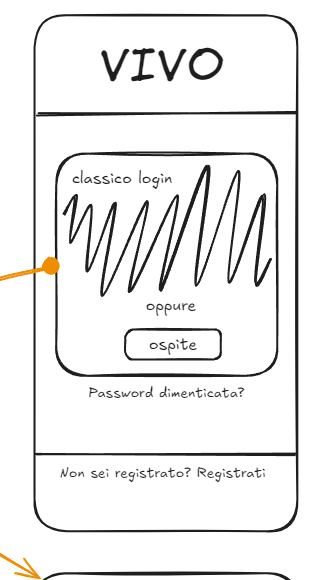
  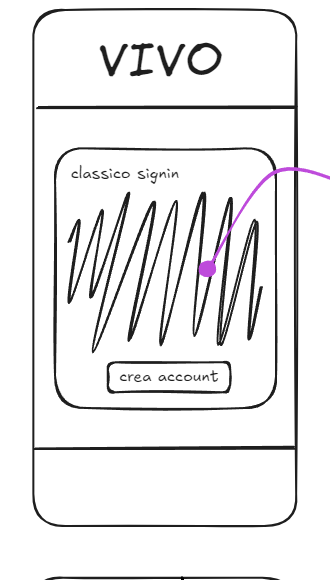

<em>Figura 3 - Sketch dell'accesso e della creazione dell'account</em>

La creazione dell'account è stata invece isolata in una schermata dedicata, raggiungibile dal rimando in fondo alla pagina di accesso e mai presentata all'avvio. Questa gerarchia mantiene la registrazione a disposizione di chi desidera conservare il proprio storico nel tempo (**REQ-07**), senza però anteporla all'uso dell'applicazione: i dati anagrafici vengono richiesti soltanto nel momento in cui l'utente ha già scelto di volere un profilo, secondo il principio per cui un'informazione va chiesta quando diventa pertinente e non prima. L'annotazione a margine dello sketch si limita del resto a registrare la necessità di raccogliere le informazioni personali per la creazione dell'account, senza prevedere alcuna procedura di configurazione da attraversare prima di poter usare l'applicazione.

Nessuna delle due impostazioni presenta alternative concorrenti da mettere a confronto, trattandosi di schermate di servizio in cui l'aderenza alle convenzioni è essa stessa il risultato desiderato. Entrambe sono state pertanto trasferite direttamente alla fase di wireframing, dove sono state arricchite con i riscontri visivi sui campi e con il messaggio esplicito sul trattamento locale dei contenuti (**REQ-05**).

### 3.2 Schermata principale: dashboard di supporto emotivo

La schermata principale è il punto in cui l'identità dell'applicazione si dichiara per intero, e le due alternative disegnate in fase esplorativa incarnano con particolare nettezza i due approcci contrapposti descritti in apertura di capitolo. La questione da risolvere non riguardava la disposizione dei componenti, ma la natura stessa dello strumento: un dispositivo di emergenza da aprire soltanto durante una crisi, oppure un compagno quotidiano che accompagna l'utente anche nei periodi di calma.

  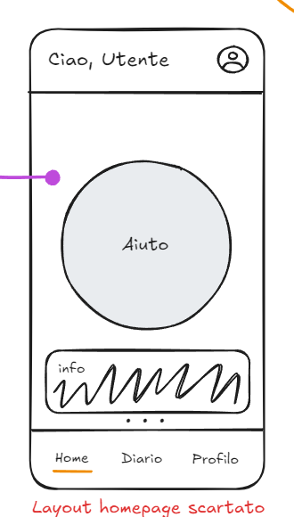
  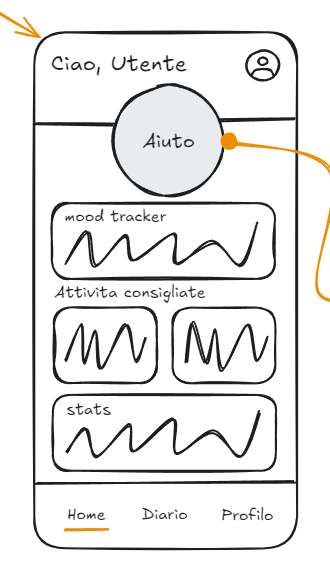

<em>Figura 4 - Le due idee di schermata principale messe a confronto: il solo gesto di emergenza e la dashboard quotidiana</em>

La prima variante riduce la schermata al solo gesto di soccorso. Un unico pulsante circolare di grandi dimensioni occupa il centro dell'interfaccia, accompagnato in basso da una fascia informativa scorrevole segnalata da indicatori di pagina. Il vantaggio è evidente e riguarda direttamente il requisito di un'interfaccia minimale e a basso carico cognitivo (**REQ-01**), poiché durante un attacco di panico non esiste alcuna possibilità di sbagliare bersaglio o di distrarsi con elementi secondari. Come annotato a margine dello sketch, tuttavia, questa impostazione presenta un difetto che ne compromette l'efficacia complessiva: una schermata tanto spoglia comunica l'idea di trovarsi davanti a un'emergenza permanente e rischia di alimentare proprio quel senso di allarme che l'applicazione dovrebbe attenuare. A ciò si aggiunge una conseguenza strutturale, ovvero che il tracciamento dell'umore (**REQ-06**), l'avvio autonomo degli esercizi (**REQ-08**) e la sintesi settimanale dei progressi (**REQ-09**) resterebbero privi di collocazione, relegando l'applicazione a uno strumento da aprire solo quando si sta male.

La seconda variante adotta invece il pattern della dashboard, articolando la schermata in card sovrapposte che restituiscono un riepilogo dello stato dell'utente e rimandano alle sezioni di dettaglio. Il pulsante di aiuto conserva una posizione preminente nella parte alta, ma non è più l'unico abitante della pagina, ed è affiancato dal tracciamento dell'umore giornaliero, dalle attività consigliate e dal riepilogo delle statistiche personali. La navigazione fra le tre aree principali è affidata a una barra inferiore persistente, secondo il pattern che le linee guida indicano come il più rapido ed efficace per applicazioni con una struttura informativa piatta, e che evita di nascondere funzioni dietro comandi che l'utente dovrebbe prima scoprire. In questo modo ciascuno dei requisiti rimasti scoperti dalla prima proposta trova una sede naturale, senza che il gesto di emergenza perda la propria riconoscibilità.

Fra le due soluzioni la prima è stata scartata. La sua radicalità formale, apparentemente coerente con il requisito di minimalità, si rivela controproducente sul piano emotivo e impedisce all'applicazione di esistere al di fuori del momento di crisi. La seconda è stata quindi selezionata come base per la fase di wireframing, dove la stessa preoccupazione sull'allarmismo che aveva condannato la variante scartata avrebbe portato a ridimensionare il pulsante di aiuto, perché il suo peso visivo non diventasse a sua volta fonte di allarme.

### 3.3 Flusso di aiuto: transizione e attività di supporto

La pressione del pulsante di aiuto non conduce direttamente al primo esercizio, ma apre una breve schermata di passaggio. La scelta risponde a una considerazione sul contesto d'uso, poiché una persona che ha appena riconosciuto l'inizio di un attacco di panico non è nella condizione di ricevere immediatamente un'istruzione operativa. Interporre un momento di accoglienza consente di segnalare che la richiesta è stata raccolta e che qualcosa sta per accadere, prima di chiedere all'utente di eseguire qualsiasi cosa.

  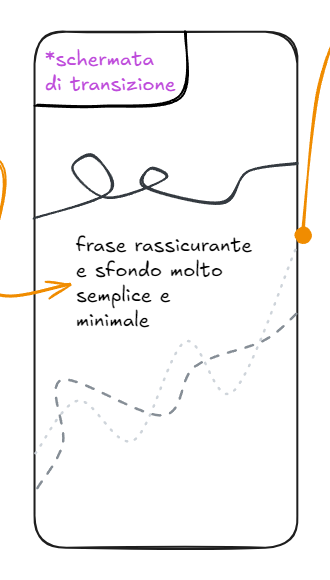

<em>Figura 5 - Sketch della schermata di transizione</em>

La schermata è stata quindi ridotta all'essenziale, con una frase rassicurante collocata al centro e uno sfondo appena accennato da linee morbide, privo di pulsanti, di intestazioni e di qualunque elemento di navigazione. L'assenza totale di comandi è una scelta deliberata, perché in questo passaggio non viene chiesta all'utente alcuna decisione. Le linee guida di design mettono in guardia dalle schermate di apertura statiche, che interrompono il flusso e sono tra le principali cause di abbandono, e il rischio è stato affrontato limitando la durata a pochi secondi e permettendo di superare la schermata con un tocco. Il requisito di navigazione reversibile e vie di fuga sicure (**REQ-03**) esclude infatti esplicitamente le schermate di passaggio dall'obbligo di esporre un comando di uscita, a condizione che si esauriscano da sole e che non trattengano chi vuole procedere.

Al termine della transizione si apre la sequenza vera e propria, composta da tre attività di supporto e da un questionario conclusivo. Nell'esplorazione le tre schermate sono state disegnate con una struttura comune, in modo che l'utente non debba reimparare l'interfaccia a ogni passaggio. Nella parte alta un indicatore di avanzamento a tre tappe dichiara il punto del percorso in cui ci si trova, secondo l'annotazione che accompagna gli sketch, mentre accanto ad esso un comando di uscita esplicito permette di interrompere la sessione in qualunque momento (**REQ-03**). In basso a sinistra un pulsante informativo mette a disposizione la spiegazione dell'esercizio soltanto a chi la richiede, applicando il principio della formazione fornita nel momento in cui serve anziché anticipata in un tutorial iniziale. Il fondo della schermata è infine occupato dal comando che conduce al passo successivo, nella posizione più comoda da raggiungere con il pollice.

Questa impostazione non presenta alternative concorrenti, poiché discende dal requisito di fornire strumenti attivi e interattivi per la gestione della crisi (**REQ-02**) e da quello di garantire una via di uscita costante. È stata pertanto trasferita integralmente al wireframing, dove è stata verificata schermata per schermata. Le tre attività e il questionario finale vengono analizzati singolarmente nei paragrafi che seguono.

#### 3.3.1 Attività 1: respirazione guidata

La prima attività del percorso è un esercizio di respirazione guidata con tecnica 4-4-4-4, scelto come punto di partenza perché agisce sulla componente fisiologica dell'attacco di panico prima ancora che su quella cognitiva. Chi sta iperventilando non è nella condizione di ragionare sui propri pensieri, mentre è ancora in grado di seguire un ritmo imposto dall'esterno, e questo rende la respirazione lo strumento più adatto ad aprire la sequenza di soccorso (**REQ-02**).

  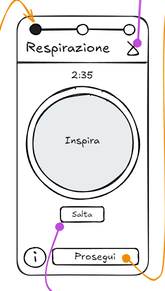

<em>Figura 6 - Sketch della respirazione guidata</em>

L'elemento centrale della schermata è una circonferenza di grandi dimensioni che si espande e si contrae seguendo le fasi dell'esercizio, accompagnata da una sola parola che dichiara cosa fare in quel momento. La scelta di affidare la guida a una forma in movimento anziché a un testo descrittivo risponde direttamente al requisito di basso carico cognitivo (**REQ-01**), poiché un ritmo visivo si imita senza doverlo leggere né interpretare. Al di sopra della circonferenza un contatore indica il tempo residuo della sessione. La sua presenza è stata valutata con attenzione, perché le linee guida osservano che un indicatore di avanzamento sposta l'attenzione sull'attesa, ma in questo contesto l'effetto è opposto e desiderabile: sapere che l'esercizio ha una durata definita e visibile rassicura chi teme di essere trattenuto in una procedura senza fine (**REQ-03**).

La decisione di progetto più significativa riguarda il comando di salto annotato a margine dello sketch, pensato per superare le fasi di trattenimento del respiro. Un ritmo rigido uguale per tutti si è rivelato inadeguato al contesto, dato che trattenere l'aria durante una crisi respiratoria può risultare faticoso e in alcuni casi accentuare l'affanno anziché ridurlo. Il comando consente quindi di proseguire nel ciclo saltando la sola pausa, senza abbandonare l'esercizio e senza costringere l'utente a subire una tempistica che il proprio corpo in quel momento non regge.

Il fondo della schermata ospita il comando che conduce all'attività successiva, disponibile in qualunque istante e non vincolato al completamento del contatore. Nessuno è quindi obbligato a portare a termine l'esercizio per accedere al resto del percorso, coerentemente con il principio di reversibilità che governa l'intero flusso (**REQ-03**). L'impostazione è stata trasferita al wireframing senza alternative concorrenti, poiché la metafora della circonferenza pulsante costituisce una convenzione consolidata nelle applicazioni di respirazione guidata e non è parso utile allontanarsene.

#### 3.3.2 Attività 2: distrazione cognitiva

La seconda attività sposta l'intervento dal corpo alla mente. Una volta rallentato il respiro, il problema che resta è il pensiero circolare che alimenta l'attacco, e la strategia adottata consiste nell'occupare l'attenzione con un compito manuale abbastanza semplice da non richiedere alcuno sforzo di comprensione. Lo sketch la definisce a margine un gioco di distrazione cognitiva, formula che ne descrive con precisione l'intento: interrompere il circolo dei pensieri catastrofici sottraendo loro le risorse attentive necessarie a sostenersi (**REQ-02**).

  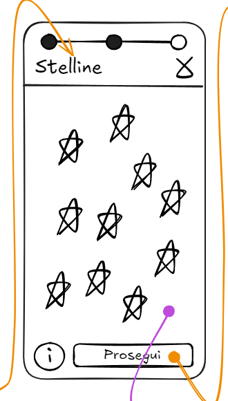

<em>Figura 7 - Sketch dell'attività delle stelle</em>

L'esercizio consiste nel comporre un cielo notturno accendendo una a una le stelle disseminate sulla schermata. La distinzione fra le stelle già accese e quelle ancora spente costituisce l'unico riscontro fornito all'utente, e l'attività si conclude quando il cielo è completo oppure quando la persona decide di passare oltre. Il compito richiede una ricerca visiva e un gesto di puntamento sufficientemente preciso da assorbire l'attenzione, ma ogni tocco produce un risultato immediato e visibile, senza che sia mai necessario ricordare una regola o pianificare una mossa.

Nella definizione di questa attività la scelta più delicata è stata quella di rinunciare a qualsiasi meccanica competitiva. Un gioco dotato di punteggio, di limite di tempo o di condizione di sconfitta avrebbe introdotto una possibilità di fallimento, e chiedere prestazioni a una persona nel mezzo di un attacco di panico avrebbe aggiunto ansia invece di sottrarne. Il compito è stato quindi costruito in modo che non esista un modo sbagliato di svolgerlo, e la sua unica ricompensa è di natura estetica, ovvero il cielo che si completa progressivamente sotto le dita dell'utente.

La disposizione irregolare delle stelle risponde infine a una necessità pratica oltre che visiva. Le dita sono strumenti di puntamento imprecisi e lo diventano ulteriormente quando il tremore accompagna la crisi, per cui gli elementi interattivi sono stati dimensionati con generosità e distanziati fra loro, in modo che un tocco approssimativo raggiunga comunque il bersaglio previsto. L'attività è stata trasferita al wireframing senza alternative concorrenti, poiché nessuna delle varianti considerate durante l'esplorazione univa altrettanto bene la semplicità del gesto all'assenza di qualsiasi pressione sull'utente.

#### 3.3.3 Attività 3: grounding 5-4-3-2-1

La terza attività chiude la sequenza riportando l'attenzione sull'ambiente circostante. La tecnica 5-4-3-2-1 chiede di individuare e nominare cinque cose che si vedono, quattro che si toccano, tre che si sentono, due che si annusano e una che si gusta, costruendo una scala che sposta progressivamente il fuoco dall'interno del corpo al mondo esterno. Rispetto alle due attività precedenti il ruolo dell'interfaccia cambia in modo sostanziale, poiché qui l'applicazione non fornisce nulla da guardare o da toccare sullo schermo ma si limita a scandire un compito che si svolge interamente nella stanza in cui l'utente si trova (**REQ-02**).

  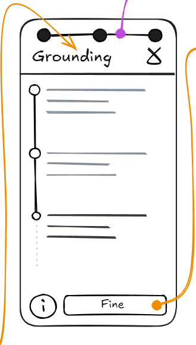

<em>Figura 8 - Sketch del grounding 5-4-3-2-1</em>

La decisione di progetto centrale riguarda il modo in cui i cinque passaggi vengono presentati. Mostrarli tutti insieme avrebbe trasformato la schermata in un elenco di istruzioni da leggere e da tenere a mente, esattamente il tipo di carico che il requisito di interfaccia minimale impone di evitare (**REQ-01**). Gli sketch adottano quindi una rivelazione progressiva lungo una linea verticale, nella quale compare un passaggio alla volta e l'utente avanza soltanto quando si sente pronto. In questo modo la persona ha davanti a sé una sola richiesta per volta, formulata con poche parole e priva di qualsiasi ramificazione.

I passaggi già completati rimangono visibili al di sopra di quello corrente, resi in una tonalità attenuata che ne dichiara la conclusione senza cancellarli. La scelta consente di rileggere ciò che si è appena fatto e restituisce la misura concreta del percorso compiuto, aspetto tutt'altro che secondario per chi fatica a percepire il passare del tempo durante una crisi. I passaggi non ancora raggiunti sono invece accennati da segnaposto grigi, secondo il principio delle schermate scheletro descritto nelle linee guida, che sposta l'attenzione sul progredire del contenuto ed evita che l'interfaccia sembri terminare dove finisce il testo visibile.

A differenza della respirazione guidata, questa attività non prevede alcun contatore e nessuna durata prestabilita. Il tempo necessario a individuare cinque oggetti dipende dall'ambiente in cui ci si trova e dalla lucidità del momento, e imporre un ritmo uniforme avrebbe trasformato un esercizio di osservazione in una prova a tempo. L'avanzamento è pertanto affidato interamente al comando premuto dall'utente, mentre la conclusione della scala conduce al questionario finale. L'impostazione è stata trasferita al wireframing senza alternative concorrenti.

#### 3.3.4 Attività conclusiva: questionario di feedback

La sequenza si chiude con un questionario che raccoglie il resoconto di quanto appena accaduto. La collocazione al termine del percorso non è casuale, poiché il ricordo di un attacco di panico si sbiadisce rapidamente e la sua intensità viene ridimensionata a distanza di ore. L'analisi dei competitor aveva evidenziato proprio in questo punto una lacuna significativa, dal momento che il tracciamento vi risulta possibile soltanto nei momenti di calma, con la conseguenza di perdere il legame fra lo stato emotivo registrato e l'episodio che lo ha provocato. Chiedere le stesse informazioni subito dopo la crisi permette invece di raccoglierle mentre sono ancora nitide (**REQ-06**).

  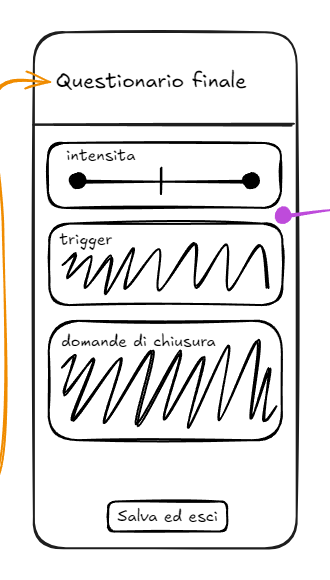

<em>Figura 9 - Sketch del questionario di chiusura</em>

Il vincolo che ha guidato la progettazione di questa schermata è la condizione di chi la incontra, ovvero una persona appena uscita da un attacco, stanca e poco disposta a compilare moduli. Ogni domanda è stata quindi ridotta a un gesto anziché a una digitazione. Lo sketch dispone verticalmente tre blocchi, nei quali l'intensità dell'attacco si dichiara facendo scorrere un cursore lungo una scala graduata, mentre il fattore scatenante e le domande di chiusura occupano due riquadri distinti la cui forma definitiva è stata rimandata alla fase successiva. L'annotazione a margine si limita infatti a registrare la necessità di un modo per descrivere l'evento che ha innescato la crisi, lasciando aperta la scelta fra una descrizione scritta e una selezione fra opzioni già disponibili.

La schermata si conclude con il comando che salva le risposte e riporta alla schermata principale, unico punto dell'intero flusso in cui il salvataggio viene dichiarato in modo esplicito. Questa formulazione rende evidente che i dati raccolti vengono conservati nel diario, dove alimentano lo storico consultabile (**REQ-07**) e la sintesi settimanale dell'andamento (**REQ-09**). Anche in questo caso non sono state disegnate alternative concorrenti, e l'impostazione è stata trasferita al wireframing così come esplorata.

### 3.4 Schermata Diario: tracking delle crisi e riflessione personale

Il diario raccoglie tutto ciò che l'applicazione registra nel tempo e costituisce la sede in cui il requisito di storico consultabile (**REQ-07**) prende forma concreta. In fase esplorativa la difficoltà principale non è stata decidere quali informazioni conservare, già stabilite dai requisiti, ma trovare un criterio che le tenesse insieme senza disperderle in sezioni separate. La soluzione adottata assume la giornata come unità di aggregazione, secondo l'annotazione a margine dello sketch che descrive l'obiettivo di racchiudere a prima vista, e giorno per giorno, tutte le informazioni necessarie all'utente.

  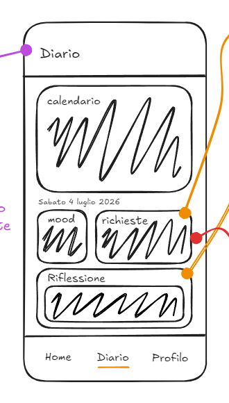

<em>Figura 10 - Sketch del diario, con il calendario e il riepilogo della giornata</em>

La schermata si apre quindi con un calendario mensile che occupa la porzione superiore e funziona da selettore, permettendo di raggiungere qualunque giornata già trascorsa senza attraversare elenchi intermedi. Alla selezione di una data la parte sottostante si aggiorna mostrando il riepilogo corrispondente, articolato in tre card affiancate o sovrapposte: l'umore registrato quel giorno (**REQ-06**), l'elenco delle richieste di aiuto avvenute (**REQ-07**) e la riflessione scritta dall'utente (**REQ-10**).

L'impostazione evita che l'utente debba ricostruire da solo la relazione fra dati che appartengono allo stesso momento. Un attacco di panico, l'umore dichiarato quella mattina e le parole scritte in serata sono episodi collegati, e separarli in schermate distinte avrebbe costretto a una navigazione ripetuta per ottenere un quadro che invece deve presentarsi in un colpo d'occhio. Il ricorso alle card mantiene inoltre riconoscibile il confine fra le tre informazioni, senza che il riepilogo si trasformi in un elenco indistinto.

Poiché ciascuna delle tre card dispone di uno spazio necessariamente limitato, l'esplorazione ha previsto che le richieste di aiuto e la riflessione potessero essere aperte in una vista dedicata, richiamabile con un tocco sulla card corrispondente. Il calendario e la struttura del riepilogo sono stati trasferiti al wireframing senza modifiche sostanziali, mentre per la vista di dettaglio delle richieste sono state disegnate due alternative, discusse nel paragrafo seguente.

#### 3.4.1 Richieste di supporto: vista di dettaglio

La card delle richieste di aiuto inserita nel riepilogo giornaliero dispone di uno spazio ridotto, sufficiente a segnalare che quel giorno si sono verificati degli episodi ma non a descriverli. Per consultarli è stata quindi prevista una vista dedicata, richiamabile con un tocco sulla card, nella quale ogni richiesta espone l'orario in cui è avvenuta, l'intensità dichiarata e il fattore scatenante indicato al termine della sessione (**REQ-07**). Per questa vista sono state disegnate due alternative che differiscono nel modo di rappresentare il singolo episodio.

  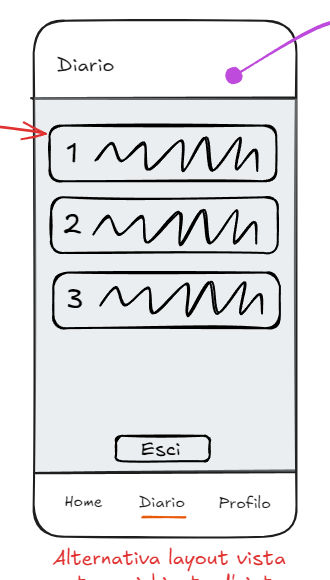
  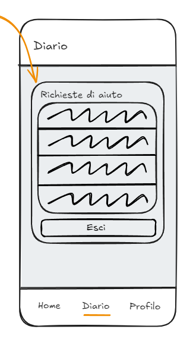

<em>Figura 11 - Le due alternative per la vista di dettaglio delle richieste di aiuto</em>

La prima variante assegna a ogni richiesta un blocco autonomo, numerato progressivamente e disteso su tutta la larghezza dello schermo. La generosità dello spazio permette di leggere senza sforzo i dati di ciascun episodio e di distinguerli a colpo d'occhio, ma la stessa impostazione mostra il proprio limite nelle giornate difficili. Quando gli attacchi sono stati numerosi l'elenco si allunga oltre l'altezza della schermata e i blocchi, separati l'uno dall'altro, finiscono per apparire come oggetti indipendenti anziché come le voci di un unico registro, indebolendo la percezione di continuità che il diario dovrebbe restituire.

La seconda variante raccoglie invece tutte le richieste all'interno di un solo contenitore, disponendole come righe compatte e sovrapposte. La densità informativa cresce sensibilmente, poiché un numero maggiore di episodi resta visibile contemporaneamente, e la forma richiama quella già impiegata nella card del riepilogo, rafforzando la coerenza interna dell'applicazione. Il vantaggio comporta però una contropartita, dal momento che l'altezza ridotta di ciascuna riga limita la quantità di informazioni esponibili e avvicina la vista all'aspetto di una tabella, con il rischio che i singoli episodi si confondano in un elenco indistinto.

L'annotazione a margine dello sketch riconosce alla prima proposta una minore adeguatezza, ma dichiara insieme che in quella fase era ancora presto per decidere, poiché il confronto teorico non bastava a stabilire quanto la maggiore leggibilità del blocco autonomo pesasse rispetto alla compattezza dell'elenco. Entrambe le alternative sono state pertanto conservate e tradotte in wireframe, per essere confrontate empiricamente nella successiva valutazione con gli utenti.

#### 3.4.2 Spazio sicuro: la riflessione personale

L'ultima delle tre card del riepilogo giornaliero ospita lo spazio di scrittura libera, l'unico punto dell'applicazione in cui l'utente si esprime con parole proprie anziché scegliere fra opzioni predefinite (**REQ-10**). Come per le richieste di aiuto, l'anteprima contenuta nel riepilogo serve soltanto a segnalare la presenza di un testo, mentre la scrittura e la rilettura avvengono in una vista dedicata che si apre con un tocco sulla card.

  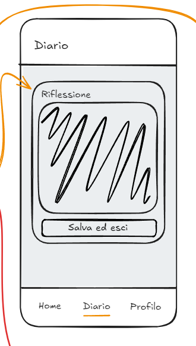

<em>Figura 12 - Sketch della riflessione personale</em>

La schermata destina quasi l'intera altezza disponibile all'area di testo, alla quale restano attorno soltanto il titolo, il comando di salvataggio e la barra di navigazione comune al resto dell'applicazione. La scelta risponde alla natura dell'attività, poiché mettere in parole un'esperienza di sofferenza richiede una concentrazione che qualsiasi elemento accessorio finirebbe per interrompere. Ogni componente non indispensabile è stato quindi rimosso, in coerenza con il requisito di interfaccia minimale (**REQ-01**) e con l'indicazione delle linee guida di ridurre al minimo la cornice grafica quando l'utente deve concentrarsi su un compito principale.

Altrettanto deliberata è l'assenza di qualsiasi struttura imposta al testo. Non sono previsti strumenti di formattazione, domande guida, modelli da completare o limiti di lunghezza, perché suggerire un argomento significherebbe orientare ciò che la persona scrive e costringere il suo vissuto entro categorie stabilite da altri. Lo spazio si presenta quindi vuoto e privo di indicazioni, disponibile tanto per poche righe quanto per un racconto disteso, e resta modificabile anche in un momento successivo, poiché la lucidità necessaria a rileggersi arriva spesso a distanza di ore dall'episodio.

La schermata si chiude con un comando esplicito che salva il testo e riporta al diario. La formulazione, che dichiara insieme il salvataggio e l'uscita, evita l'ambiguità di un semplice comando di chiusura, dal quale l'utente non potrebbe dedurre se quanto scritto verrà conservato oppure perduto. Il requisito di navigazione reversibile chiede infatti che le conseguenze di un abbandono siano dichiarate prima che questo avvenga (**REQ-03**). L'impostazione non presenta alternative concorrenti ed è stata trasferita al wireframing così come esplorata.

### 3.5 Schermata Profilo: dati utente e preferenze di notifica

Il profilo occupa la terza scheda della barra di navigazione ed è l'unica area dell'applicazione che non interviene nella gestione della crisi. Vi confluiscono i dati anagrafici dell'account, le preferenze di funzionamento e i comandi che agiscono sull'archivio personale, ovvero tutto ciò che una persona consulta di rado e sempre in condizioni di calma. Questa differenza di contesto ha permesso di adottare una densità informativa superiore rispetto alle altre schermate, senza contraddire il requisito di interfaccia minimale, che riguarda i momenti di vulnerabilità e non l'intera applicazione (**REQ-01**).

  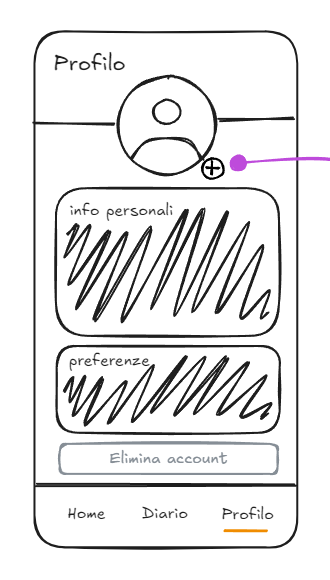

<em>Figura 13 - Sketch del profilo</em>

La schermata si apre con l'immagine dell'utente, alla quale è affiancato un comando dedicato alla sua sostituzione, come indicato dall'annotazione a margine dello sketch. Al di sotto si susseguono due blocchi distinti, il primo destinato ai dati personali inseriti in fase di registrazione e il secondo alle preferenze, dove trova posto l'attivazione del promemoria quotidiano (**REQ-12**). La separazione in blocchi consente di distinguere a colpo d'occhio ciò che descrive l'utente da ciò che regola il comportamento dell'applicazione.

La decisione di progetto più delicata riguarda l'eliminazione dell'account, comando che il requisito di riservatezza impone di rendere disponibile, poiché a chi ha creato un profilo deve restare la possibilità di cancellare l'intero archivio in qualsiasi momento (**REQ-05**). Lo stesso comando è però l'unico dell'applicazione a produrre una perdita irreversibile di dati, e le linee guida raccomandano di collocare le azioni distruttive al di fuori della zona raggiungibile senza intenzione. Nello sketch è stato quindi isolato in fondo alla schermata, oltre i blocchi che raccolgono le funzioni ordinarie, e disegnato con un contorno privo di riempimento che ne abbassa il peso visivo rispetto agli altri comandi.

L'accostamento fra le due esigenze si risolve così senza sacrificarne nessuna, dal momento che il comando resta presente e individuabile da chi lo cerca, ma non compete per l'attenzione di chi sta semplicemente consultando i propri dati. Anche in questo caso non sono state esplorate alternative concorrenti, poiché l'organizzazione per blocchi tematici costituisce una convenzione consolidata per le schermate di impostazioni, e l'impostazione è stata trasferita al wireframing così come disegnata.

### 3.6 Mappa delle transizioni e flusso di aiuto

Gli sketch esaminati fino a questo punto descrivono le singole schermate, ma non dicono nulla su come si raggiungano l'una dall'altra. Per questa ragione l'esplorazione non è stata condotta su fogli separati, bensì disponendo tutte le interfacce su un'unica superficie e tracciando direttamente su di essa i collegamenti fra loro. La rappresentazione che ne risulta corrisponde a quanto le linee guida descrivono come flusso delle attività, ovvero la sequenza di schermate attraverso cui l'utente passa per portare a termine un compito, e costituisce il complemento naturale dei prototipi appena presentati.

Sul foglio convivono tre tipi di segno, ciascuno con una funzione distinta. Le frecce arancioni rappresentano le transizioni effettive fra le schermate e permettono di seguire un percorso dall'inizio alla fine senza ricostruirlo a memoria. I segni rossi collegano invece una schermata alla propria variante alternativa e ne dichiarano l'esito, come nel caso del layout della schermata principale contrassegnato come scartato. Le annotazioni viola, infine, non descrivono movimenti ma motivazioni, e registrano accanto all'elemento interessato la ragione di una scelta oppure il difetto che ne ha determinato l'abbandono.

La lettura d'insieme rende immediatamente visibile la struttura di navigazione dell'applicazione. Dalle tre aree raggiungibili con la barra inferiore si diramano percorsi di natura differente, poiché il diario apre viste di dettaglio dalle quali si torna indietro, mentre il pulsante di aiuto avvia una sequenza lineare che attraversa la transizione, le tre attività e il questionario conclusivo. Proprio in questa sequenza le schermate sono state disegnate senza la barra di navigazione, scelta che sul foglio appare con particolare evidenza e che dichiara l'intenzione di isolare il percorso di soccorso dal resto dell'applicazione.

Le linee guida raccomandano di non costruire un unico flusso che pretenda di contenere l'intero sistema, ma di concentrarsi sugli scenari principali. Nel caso di Vivo l'architettura è risultata sufficientemente contenuta da poter essere rappresentata per intero senza compromettere la leggibilità, e mantenere ogni cosa sotto lo stesso sguardo ha permesso di valutare simultaneamente le transizioni, le alternative in competizione e le motivazioni annotate. La mappa ha così confermato la struttura di navigazione adottata e ha costituito il punto di partenza della successiva traduzione in wireframe.

  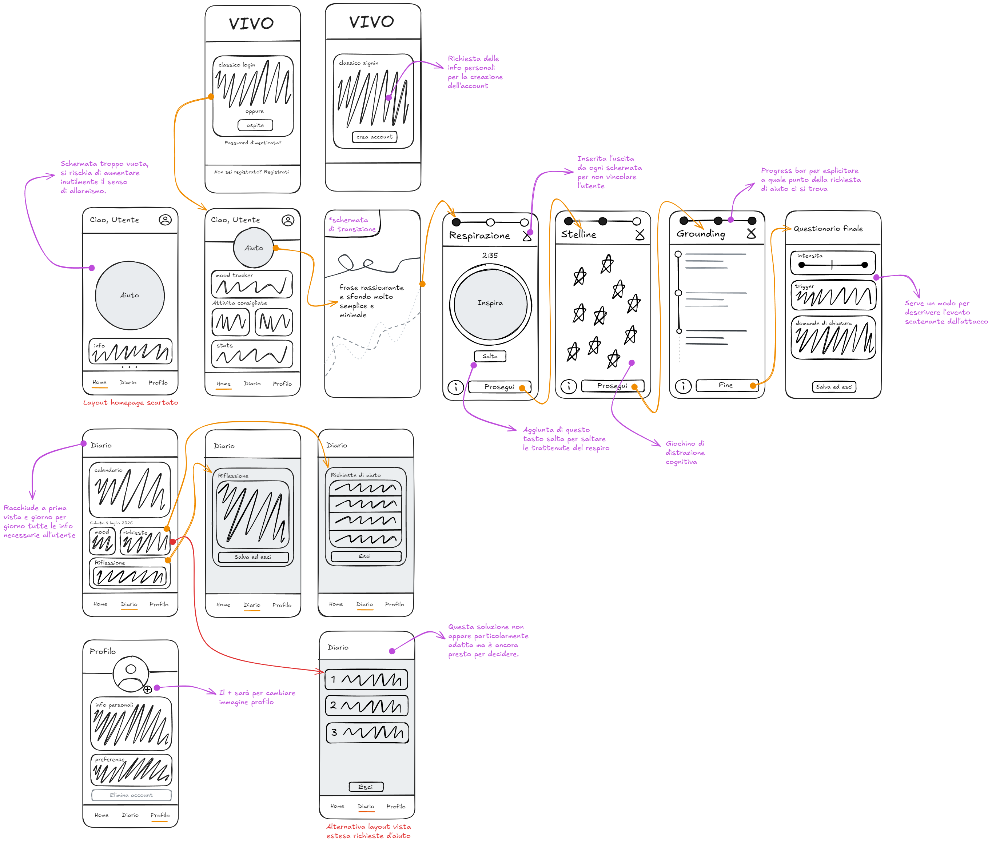

<em>Figura 14 - Il foglio completo degli sketch: in arancione le transizioni, in rosso le alternative in competizione, in viola le motivazioni annotate</em>

## 4. Wireframe

Terminata la fase esplorativa, i concept selezionati sono stati trasformati in prototipi digitali a media fedeltà (wireframe). Al fine di tradurre gli sketch manuali in layout interattivi e navigabili, per la modellazione delle interfacce è stato adottato Figma, strumento di riferimento per la progettazione UI/UX. Lavorare con questo livello di fedeltà intermedio ha consentito di definire con precisione l'architettura dell'informazione, i flussi di navigazione e la disposizione spaziale dei componenti. Infine, la scelta di mantenere le schermate in scala di grigi è nata dalla necessità di concentrare l'analisi sui soli aspetti strutturali, ergonomici e funzionali. Di conseguenza, le variabili cromatiche e stilistiche sono state escluse temporaneamente, pur riconoscendo la loro importanza in un'applicazione dedicata al benessere mentale.

In questo passaggio le interfacce definite in fase di sketch sono state ricostruite in ambiente digitale e, laddove il confronto teorico non aveva individuato un'opzione prevalente, si è proceduto a modellare entrambe le alternative. È il caso della pagina del diario e della vista di dettaglio delle richieste di aiuto (**REQ-07**), per le quali sono state realizzate due versioni destinate al confronto empirico con gli utenti. Il maggiore grado di dettaglio ha inoltre permesso di verificare la tenuta dei layout e la gerarchia visiva sulle dimensioni reali di uno schermo mobile, facendo emergere alcune correzioni rispetto ai prototipi disegnati a mano che vengono discusse nelle sezioni corrispondenti.

### 4.1 Struttura di navigazione e layout

Il passaggio alla media fedeltà ha consentito di verificare e dimensionare con precisione il sistema di navigazione già ipotizzato in fase esplorativa, misurandone l'ingombro effettivo sulla risoluzione di uno schermo mobile di riferimento. Il lavoro non ha modificato la struttura definita con gli sketch, ma ne ha stabilito le proporzioni, le distanze e le aree sensibili al tocco.

La navigazione primaria resta affidata a una barra inferiore persistente, che separa le tre aree principali dell'applicazione, ovvero la schermata di supporto emotivo, il diario personale e il profilo. La scelta di una navigazione sempre visibile anziché di un menu richiamabile con un gesto discende dalle evidenze presentate nelle linee guida, secondo le quali qualsiasi metodo di navigazione nascosto risulta meno individuabile e conduce a un utilizzo ridotto delle funzioni che nasconde. Gli stessi confronti indicano nella barra inferiore il pattern che consente i tempi di navigazione più brevi rispetto al menu laterale e alla barra superiore a schede, e in un'applicazione destinata a essere aperta durante una crisi ogni passaggio risparmiato ha un peso concreto (**REQ-04**). La scheda attiva è stata inoltre evidenziata rispetto alle altre, in modo che l'utente riconosca sempre il proprio punto di posizione all'interno dell'applicazione.

La fascia superiore adotta un blocco pieno che occupa l'intera larghezza e ospita il titolo della sezione corrente accompagnato da una breve riga esplicativa. Il contrasto fra questa fascia e il fondo chiaro del corpo della pagina fornisce a ogni schermata una cornice riconoscibile e costante, mentre l'area compresa fra le due estremità resta interamente disponibile ai contenuti, organizzati in card che scorrono verticalmente. La distinzione fra la navigazione collocata in basso e le informazioni di contesto collocate in alto mantiene una gerarchia visiva pulita e previene il sovraccarico cognitivo (**REQ-01**).

Nelle schermate che chiedono all'utente di procedere, ovvero quelle del flusso di aiuto e le viste di dettaglio del diario, il comando principale è stato collocato nella porzione inferiore dell'area di contenuto, dove le linee guida individuano la zona di naturale estensione del pollice nell'uso a una mano. Le dimensioni degli elementi interattivi sono state verificate rispetto alle misure minime raccomandate per i target tattili, così che restino raggiungibili anche da chi li preme con la mano tremante.

### 4.2 Schermata di accesso: login e creazione account

La progettazione dell'area di accesso si fonda sulla massima rassicurazione e sulla riduzione dell'attrito iniziale. Nella porzione superiore lo spazio è dominato dal logo dell'applicazione inserito in un blocco scuro che definisce l'identità visiva del brand. Il modulo centrale di autenticazione accoglie l'utente con un messaggio di benvenuto e istruzioni chiare, racchiudendo in un layout verticale pulito i campi per l'inserimento di email e password. Quest'ultimo campo integra un'icona dedicata alla visibilità del testo, offrendo un riscontro immediato e prevenendo errori di digitazione.

Accanto al pulsante principale di accesso è stata inserita un'opzione strategica fondamentale per un'applicazione focalizzata sul benessere mentale: il comando per continuare come ospite. Questa scelta di design permette di bypassare la registrazione immediata riducendo drasticamente l'ansia da prestazione o la frustrazione di un utente che necessita di supporto rapido. Al di sotto del box principale trovano spazio il link per il recupero della password e un'icona con un messaggio esplicito sulla privacy e sulla protezione delle riflessioni personali. Infine, la barra inferiore ospita il rinvio alla schermata di registrazione, completando un'architettura che bilancia sicurezza, flessibilità e immediatezza d'uso.

  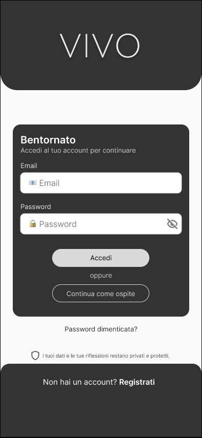

<em>Figura 15 - Wireframe dell'accesso</em>

La schermata di creazione del profilo riprende integralmente l'impostazione di quella di accesso, così che il passaggio dall'una all'altra non richieda alcun riorientamento. La fascia superiore ospita il titolo dell'operazione accompagnato da una riga che ne dichiara la natura locale, mentre il corpo raccoglie in un unico modulo verticale i campi necessari all'identificazione del profilo, ovvero nome, cognome, indirizzo di posta elettronica e password con la relativa conferma. I campi sono disposti in sequenza verticale e ciascuno è preceduto dalla propria etichetta, mentre la conferma della password segue immediatamente il campo a cui si riferisce, così che un errore di digitazione emerga durante l'inserimento anziché al momento dell'invio.

L'intestazione mantiene un comando di ritorno alla schermata precedente, coerentemente con il principio di reversibilità che governa l'intera applicazione (**REQ-03**), e nessun passaggio di configurazione viene interposto fra la creazione del profilo e l'accesso alle funzioni (**REQ-04**). Al di sotto del pulsante di conferma trova infine posto un messaggio esplicito sul trattamento dei dati, collocato deliberatamente nel punto in cui all'utente viene chiesto di consegnarli. La rassicurazione sulla conservazione esclusivamente locale delle informazioni (**REQ-05**) compare quindi nel momento esatto in cui diventa pertinente, anziché essere relegata a un documento che nessuno leggerebbe.

  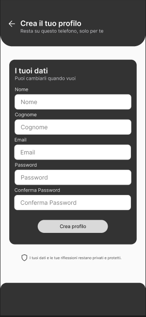

<em>Figura 16 - Wireframe della creazione del profilo</em>

### 4.3 Schermata principale: dashboard di supporto emotivo

Lo sviluppo del wireframe per la schermata principale ha permesso di tradurre in veste grafica le riflessioni emerse in fase esplorativa. Nello specifico, il pulsante di emergenza è stato leggermente ridimensionato e riposizionato rispetto al centro assoluto per evitare di generare ulteriore allarmismo durante un attacco. Inoltre, si è deciso di non renderlo l'unico elemento della homepage, pur mantenendo l'interfaccia semplice e con un carico informativo ridotto. L'elemento mantiene comunque una priorità gerarchica chiara e non passa in secondo piano. Lavorare a questo livello di dettaglio ha consentito di bilanciare accuratamente i pesi visivi e la distribuzione delle informazioni sul dispositivo.

  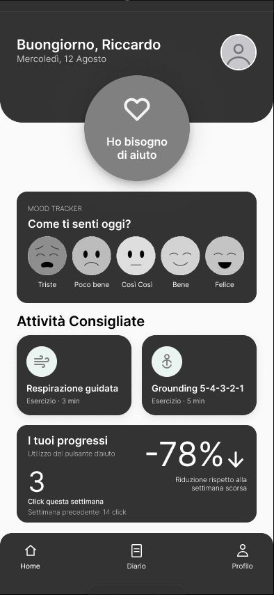

<em>Figura 17 - Wireframe della schermata principale</em>

L'architettura modulare della schermata è stata studiata per bilanciare l'immediata leggibilità generale con la rapida individuazione delle funzioni di supporto. Il pulsante di emergenza ("Ho bisogno di aiuto") sfrutta il contrasto visivo e l'isolamento spaziale per emergere in modo inequivocabile. Tuttavia, non essendo l'elemento di maggiori dimensioni in assoluto, garantisce visibilità senza generare un senso di allarme o urgenza ansiogena. Parallelamente, la sezione delle attività consigliate è concepita come una scorciatoia ad accesso rapido, che permette di avviare un esercizio di stabilizzazione in autonomia senza attivare una sessione di soccorso vera e propria, mentre la card dei progressi restituisce l'andamento delle richieste nel tempo.

Coerentemente con la natura di un prototipo a media fedeltà, si è optato per l'impiego di forme geometriche e placeholder in scala di grigi. Questa impostazione permette di abbattere il carico cognitivo derivante da colori o immagini dettagliate, focalizzando l'analisi esclusivamente sull'architettura della Home, sull'allineamento delle card e sulla fluidità di fruizione del supporto psicologico.

### 4.4 Flusso di aiuto: transizione e attività di supporto

Per guidare l'utente verso le attività di supporto è stata progettata una schermata di transizione in linea con gli sketch esplorativi. Questa interfaccia, che l'utente può decidere di saltare con un semplice tocco, ha lo scopo di confortare la persona, cercando di metterla a proprio agio. L'obiettivo è offrire un primo momento di rassicurazione, pur essendo consapevoli dell'estrema difficoltà emotiva che caratterizza un attacco di panico.

  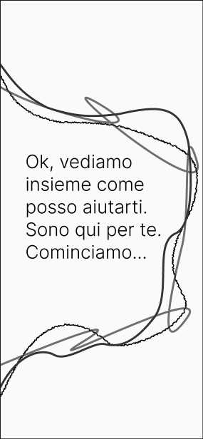

<em>Figura 18 - Wireframe della schermata di transizione</em>

Le tre attività di supporto vengono ora esaminate a livello di media fedeltà, ciascuna nella propria sezione.

Si segnala che i wireframe di queste schermate conservano la barra di navigazione inferiore per uniformità con il resto dell'applicazione, benché gli sketch esplorativi l'avessero omessa. La contraddizione fra le due soluzioni è stata deliberatamente lasciata aperta e portata alla valutazione con gli utenti, poiché soltanto osservando qualcuno interrompere una sessione si poteva stabilire se quelle tre schede costituissero una comodità oppure una via d'uscita involontaria, capace di far perdere i progressi dell'esercizio in un momento di particolare fragilità.

#### 4.4.1 Attività 1: respirazione guidata

L'interfaccia dedicata alla respirazione centralizza il focus visivo dell'utente tramite un indicatore circolare di grandi dimensioni posizionato al centro del viewport. Questa scelta geometrica asseconda il ritmo della tecnica, fornendo un feedback visivo continuo che accompagna le delicate fasi di inspirazione ed espirazione. Per garantire il pieno controllo dell'esperienza, è stato inserito un comando inferiore che permette di eludere le pause di mantenimento. L'assenza di elementi periferici superflui minimizza le distrazioni, convogliando tutta l'attenzione sull'esercizio respiratorio e sul ripristino della calma.

  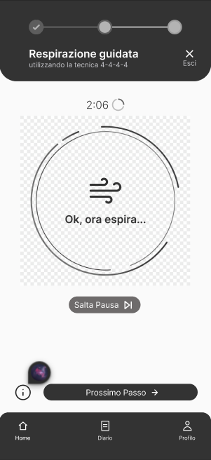

<em>Figura 19 - Wireframe della respirazione guidata</em>

#### 4.4.2 Attività 2: distrazione cognitiva

Per l'esercizio di riorientamento attentivo, il layout abbandona la tradizionale rigidità strutturale a favore di una disposizione sparsa e apparentemente casuale degli elementi interattivi. La schermata invita l'utente a interagire con diverse sagome a forma di stella distribuite sull'intero spazio di lavoro. Questa microinterazione tattile funge da ancoraggio nel momento presente, interrompendo efficacemente il sovraccarico ansioso. Il riempimento delle forme al tocco fornisce un rinforzo visivo immediato, premiando l'azione e incentivando la prosecuzione del compito senza generare alcun tipo di stress aggiuntivo.

  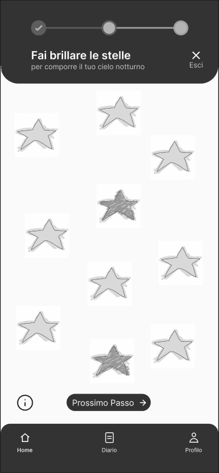

<em>Figura 20 - Wireframe dell'attività delle stelle</em>

#### 4.4.3 Attività 3: grounding 5-4-3-2-1

La tecnica di grounding spaziale sfrutta un pattern di navigazione verticale a step progressivi, riprendendo la logica visiva di una timeline. Questa architettura frammenta il compito cognitivo in porzioni facilmente assimilabili, riducendo drasticamente lo sforzo di lettura per un utente in stato di agitazione. La forte gerarchia tipografica separa in modo netto i numeri chiave dalle istruzioni operative, guidando lo sguardo in modo ordinato. Lo scorrimento dell'interfaccia svela gradualmente i passaggi successivi, accompagnando dolcemente la persona verso il completamento della procedura sensoriale.

  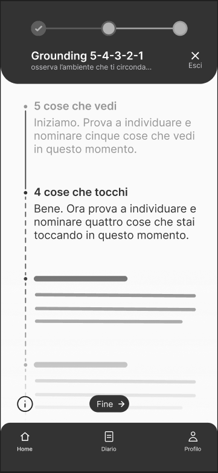

<em>Figura 21 - Wireframe del grounding 5-4-3-2-1</em>

#### 4.4.4 Attività conclusiva: questionario di feedback

La fase finale del processo di stabilizzazione prevede la compilazione di un breve questionario del tutto opzionale. L'inserimento di questo passaggio permette di tracciare l'evoluzione emotiva dell'utente, rispettando pienamente i suoi tempi di recupero. Occorre inoltre evidenziare una scelta progettuale trasversale a tutto il flusso, ovvero che l'interruzione volontaria del percorso è consentita in ogni momento. Progettare interfacce prive di vie di fuga rischia infatti di amplificare la sensazione di panico. L'integrazione di un comando di uscita sempre disponibile spezza le dinamiche mentali che favoriscono l'ansia, conferendo all'utente una totale autonomia decisionale.

  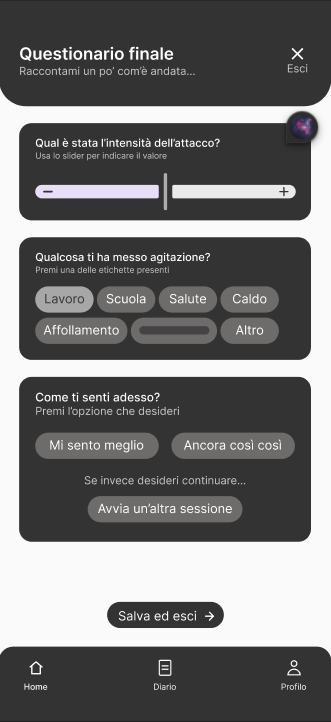

<em>Figura 22 - Wireframe del questionario di chiusura</em>

Il passaggio alla media fedeltà ha inoltre sciolto due questioni che gli sketch avevano lasciato aperte. Il fattore scatenante, per il quale l'esplorazione si era limitata a registrare la necessità di un modo per descriverlo, viene ora indicato premendo una fra le etichette già presenti sullo schermo, alle quali se ne affianca una generica che consente di rispondere anche quando la causa non rientra fra quelle previste, senza costringere l'utente a formulare una descrizione. Fra le domande di chiusura compare poi l'interrogativo sullo stato dell'utente in quel momento, al quale è stata associata la possibilità di avviare immediatamente un'altra sessione. La scelta nasce dal riconoscimento che il percorso di soccorso può non risultare sufficiente al primo tentativo, e che in tal caso obbligare la persona a tornare alla schermata principale e a premere nuovamente il pulsante di aiuto costituirebbe un attrito inutile in un momento di fragilità.

### 4.5 Schermata Diario: tracking delle crisi e riflessione personale

Per il tracking delle crisi, per il monitoraggio dello stato emotivo e per l'inserimento di una riflessione a freddo, pensata per i momenti in cui l'utente si trova in una condizione di calma, sono state modellate entrambe le opzioni ideate nella fase precedente.

L'obiettivo è stato quello di realizzare due interfacce interattive per la pagina del diario e per la vista estesa delle richieste d'aiuto da mettere a confronto. Questo approccio ha permesso di valutare empiricamente il miglior punto di equilibrio tra rapidità operativa e completezza della raccolta dati.

Osservando la prima proposta per la sezione principale del diario si nota l'adozione di un layout pressoché tabulare per la card delle richieste di aiuto. Questa struttura includeva anche il fattore scatenante dell'attacco, ma risultava complessa da scansionare a colpo d'occhio, rendendo difficile percepire immediatamente l'intensità della crisi.

  

<em>Figura 23 - Prima proposta per il diario, con la card delle richieste in forma di tabella</em>

Nella seconda proposta la card conserva le tre informazioni essenziali di ciascun episodio, ovvero il numero progressivo, l'orario in cui la richiesta è stata avviata e l'intensità dichiarata. Quest'ultima non è più esposta come semplice frazione numerica ma affidata a un indicatore che affianca al valore un riempimento proporzionale, leggibile senza doverlo interpretare. Il fattore scatenante, presente nella versione precedente, è stato spostato nella vista di dettaglio, dove lo spazio disponibile consente di riportarlo per esteso. Sotto le righe visibili resta un accenno grafico alla presenza di ulteriori registrazioni, che segnala la continuazione dell'elenco senza occupare altezza e invita ad aprire la vista estesa (**REQ-07**).

  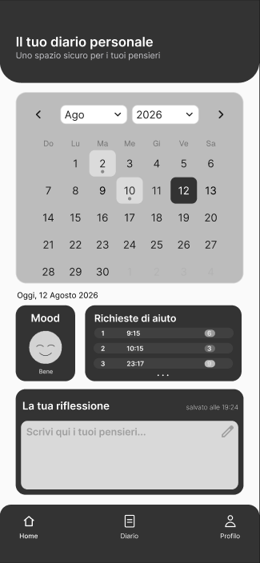

<em>Figura 24 - Seconda proposta per il diario, con l'intensità affidata a un indicatore proporzionale</em>

Pur presentando un layout pressoché identico alla versione precedente, questa proposta interviene su un solo dettaglio visivo, ovvero il modo in cui viene comunicata l'intensità, ed è proprio per questo che è stata portata al confronto con gli utenti anziché adottata senza verifica. L'esclusione del fattore scatenante dalla vista compatta alleggerisce la lettura, e l'intensità viene comunicata in modo visivo e immediato, offrendo una panoramica della giornata senza costringere l'utente a decifrare dei numeri. Nelle applicazioni orientate alla gestione dell'ansia accortezze di questo tipo risultano fondamentali per non sovraccaricare chi legge, e distinguono il progetto da competitor spesso affollati di elementi superflui.

#### 4.5.1 Richieste di supporto: vista di dettaglio

Relativamente al dettaglio delle richieste di supporto, accessibile interagendo con la card compatta, sono state sviluppate due diverse interfacce. Come anticipato nella sezione precedente, questa esplorazione in media fedeltà ha permesso di analizzare le criticità di ciascuna soluzione. La prima bozza prevedeva la comparsa di una serie di componenti modali numerati. Tuttavia, questi elementi in sovrimpressione non avrebbero trasmesso un senso di ordine e connessione logica, finendo per compromettere la gerarchia visiva e la pulizia formale richieste dal progetto.

  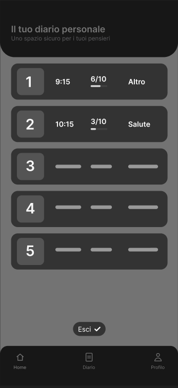

<em>Figura 25 - Prima versione del dettaglio delle richieste, a blocchi modali numerati</em>

La seconda versione si ispira fortemente al pattern di navigazione utilizzato per l'inserimento della riflessione personale. Si è deciso di modellare anche questa soluzione per mantenere una solida coerenza interna all'applicazione e per verificare, nel confronto con gli utenti, se un'interfaccia più semplice da consultare risultasse anche più efficace.

  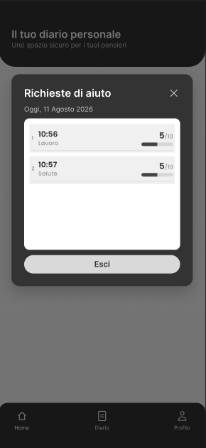

<em>Figura 26 - Seconda versione del dettaglio delle richieste, raccolte in un riquadro unico</em>

#### 4.5.2 Spazio sicuro: la riflessione personale

Per quanto riguarda la riflessione personale, la transizione in media fedeltà risulta pienamente soddisfacente. Il riquadro si apre sopra il diario oscurato e destina quasi tutta la propria altezza all'area di scrittura, lasciandole attorno soltanto il titolo, il comando di chiusura e il pulsante di salvataggio. L'assenza di elementi visivi aggiuntivi e l'isolamento del focus cognitivo evitano qualsiasi distrazione durante questo delicato momento di introspezione. Rispetto allo sketch il comando conclusivo si riduce alla sola parola "Salva", mentre il disegno a mano libera dichiarava insieme il salvataggio e l'uscita.

  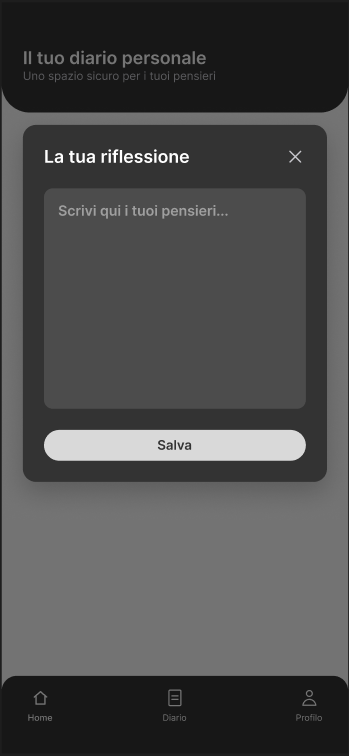

<em>Figura 27 - Wireframe della riflessione personale</em>

### 4.6 Schermata Profilo: dati utente e preferenze di notifica

La progettazione del profilo utente adotta un'architettura a card per raggruppare visivamente le informazioni e ridurre il carico cognitivo. Il primo blocco è interamente dedicato ai dati personali (**REQ-11**), presentando campi di testo dal design pulito e un comando di salvataggio contestuale per evitare ambiguità operative. La seconda sezione isola invece le impostazioni di sistema, affidando la gestione delle notifiche a un interruttore visivo dal feedback immediato e racchiudendo le opzioni di sicurezza secondarie in comandi ben distinti.

Particolare attenzione è stata riservata all'azione distruttiva di eliminazione dell'account. Per prevenire tocchi accidentali, questo comando è stato fisicamente isolato dalle card principali e declinato con uno stile visivo privo di riempimento. Questa strategia abbassa il peso gerarchico del pulsante, garantendo che la cancellazione avvenga solo tramite una volontà chiara e consapevole dell'utente.

  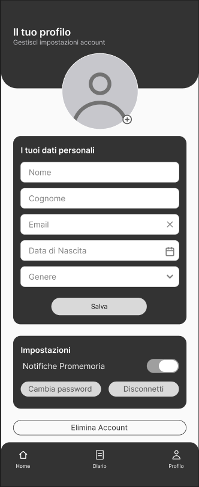

<em>Figura 28 - Wireframe del profilo</em>

### 4.7 Direzione visiva: il mockup e la scelta della combinazione

I wireframe presentati fino a questo punto sono deliberatamente privi di colore, e questa assenza lascia aperta una domanda che nessuna schermata in scala di grigi può risolvere, ovvero quale aspetto debba avere un'applicazione destinata a essere aperta nei momenti peggiori della giornata. Le linee guida viste a lezione indicano per questo passaggio l'uso di style tiles e mood board, cioè di proposte stilistiche alternative da confrontare fra loro, e raccomandano di non fermarsi alla prima idea, ma di costruirne più di una e di confrontarle a parità di contenuto.

Per condurre il confronto è stato generato un mockup interattivo in HTML che riproduce undici schermate dell'applicazione con la stessa struttura dei wireframe. Il mockup espone quattro controlli, ovvero la palette dei colori, il carattere tipografico, lo stile chiaro o scuro delle card e, per le card scure, il grado di scurezza. La scelta di un mockup navigabile anziché di semplici tavole di campioni risponde a un problema concreto, poiché una combinazione gradevole su un quadrato di colore può risultare inadeguata quando riveste un'intestazione, una barra di navigazione, un pulsante di emergenza e undici schermate diverse. Cambiando un controllo tutte le schermate si aggiornano insieme, cosicché il confronto avvenga sempre a parità di contenuto.

L'esplorazione è partita da una prima veste a colori applicata alla schermata principale, che dà il nome alla palette Concept, e si è poi allargata ad altre tre direzioni costruite per allontanarsene ciascuna in un verso diverso. Le quattro palette messe a confronto sono le seguenti.

| Palette | Intestazioni | Accento | Carattere della proposta |
| --- | --- | --- | --- |
| Concept | `#174A46` teal profondo | `#D8A5C5` rosa cipria | Naturale e calda, con un accento di tono attenuato |
| Notturno | `#1D2A4A` blu notte | `#A79BD6` lavanda | Più fredda e istituzionale, vicina alle applicazioni di meditazione |
| Terra | `#3B4A3E` verde bosco | `#DFA079` terracotta | Materica e avvolgente, con un accento caldo che tende all'arancione |
| Bruma | `#2A3840` ardesia | `#93BFCB` azzurro polvere | Quieta e distaccata, con contrasti attenuati |

  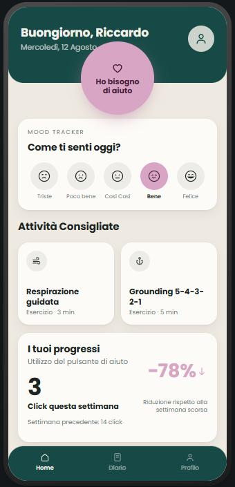
  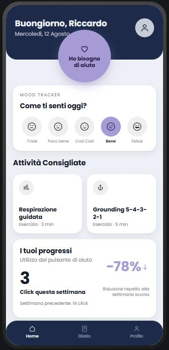
  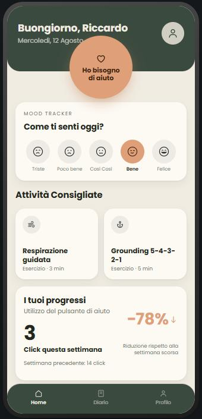
  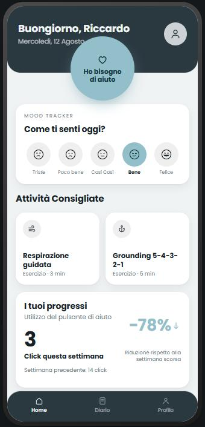

<em>Figura 29 - La schermata principale nelle quattro palette messe a confronto: Concept, Notturno, Terra e Bruma</em>

La Figura 29 riproduce la schermata principale nelle quattro varianti, nell'ordine della tabella, e mostra quanto una stessa struttura cambi di temperatura al variare della sola combinazione cromatica.

La combinazione adottata unisce la palette Concept, il carattere morbido dalle forme tondeggianti e le card chiare. Il confronto fra le palette è stato condotto rispetto a tre criteri fissati prima di guardare le varianti, e ciascuno di essi ne ha esclusa una. Il primo riguarda l'accento, che riveste il pulsante di richiesta di aiuto, e discende dall'analisi dei competitor: il rosso adottato da Rootd e da Dare induce urgenza anziché rassicurazione, e il colore dell'accento non deve quindi ricadere nella gamma dei segnali di avviso. Il criterio esclude Terra, il cui terracotta tende all'arancione. Il secondo riguarda la leggibilità sulle schermate intere, ed esclude Bruma, i cui contrasti attenuati indeboliscono proprio le scritte che devono restare leggibili quando l'utente sta male. Il terzo riguarda il tono, ed esclude Notturno, più freddo e istituzionale, che avvicina Vivo alle applicazioni di meditazione da cui il progetto intende distinguersi. Resta Concept, il cui rosa cipria non richiama né un allarme né una tinta fredda. La scelta è ricaduta sulla proposta di partenza, ma solo dopo che le alternative erano state costruite e osservate sulle schermate intere, per verificare se una di esse reggesse meglio i tre criteri.

Il carattere morbido è stato scelto per coerenza con il tono dell'applicazione, poiché le forme tondeggianti risultano meno perentorie di quelle tecniche o editoriali. Le card chiare, infine, sono state preferite a quelle scure ipotizzate nei wireframe perché mantengono le schermate leggibili anche con la luminosità del telefono abbassata, e con esse il quarto controllo del mockup, il grado di scurezza delle card, ha smesso di avere oggetto. Card e fondo restano però due bianchi caldi vicini fra loro, e il solo colore non basta a distinguerli: le card sono quindi sollevate da un'ombra tinta con il teal della palette, che ne segna il confine senza bordi marcati e senza il grigiore che un'ombra nera produrrebbe sul fondo crema.

## 5. Valutazione con utenti

I wireframe descritti nel capitolo precedente sono stati sottoposti a una valutazione con utenti reali, condotta con l'obiettivo di verificare la tenuta delle scelte già consolidate e di sciogliere i due confronti progettuali che la fase di prototipazione aveva deliberatamente lasciato aperti. La valutazione non ha avuto carattere autonomo. In tutte le sessioni il valutatore è rimasto presente per assegnare i task, osservare direttamente l'esecuzione e raccogliere le verbalizzazioni dei partecipanti, senza però intervenire con suggerimenti se non in caso di blocco completo.

### 5.1 Partecipanti e modalità di conduzione

Il campione è composto da cinque persone. Il numero non è casuale, poiché nella pratica della valutazione di usabilità cinque partecipanti costituiscono la soglia oltre la quale i nuovi soggetti tendono a segnalare problemi già emersi, e l'obiettivo dell'indagine non era misurare tempi con validità statistica ma individuare i punti in cui l'interfaccia si comporta diversamente da come l'utente si aspetta. I partecipanti sono stati scelti in modo da coprire entrambi i profili descritti dalle personas, ovvero chi incontrerebbe l'applicazione nel momento della crisi e chi la utilizzerebbe come strumento di osservazione nel tempo.

| Utente | Profilo |
| --- | --- |
| U1 | 21 anni, studentessa universitaria fuorisede. Riferisce episodi di ansia concentrati nei periodi d'esame e non ha mai utilizzato applicazioni dedicate al benessere mentale |
| U2 | 24 anni, studente di Informatica. Elevata competenza digitale e nessuna esperienza pregressa del dominio, profilo utile a verificare la sola chiarezza dell'interfaccia |
| U3 | 27 anni, lavoratrice dipendente. Utilizza abitualmente applicazioni di meditazione e mindfulness, e conosce quindi le convenzioni consolidate del settore |
| U4 | 35 anni, impiegato. Segue un percorso psicoterapeutico e utilizza lo smartphone per poche applicazioni, sempre le stesse |
| U5 | 19 anni, matricola universitaria. Uso intensivo dello smartphone e nessuna abitudine di tracciamento del proprio stato emotivo |

La valutazione ha assunto la forma di sessioni moderate sui wireframe interattivi, tre in presenza con U1, U3 e U4 e due a distanza in videochiamata con condivisione dello schermo per U2 e U5. Ogni incontro è durato fra i venti e i trenta minuti. Ai partecipanti è stato chiesto di applicare il protocollo del pensiero ad alta voce, verbalizzando dubbi, aspettative e ragioni di ogni scelta, così da raccogliere indicazioni sul carico cognitivo mentre questo si manifestava e non a posteriori. I task sono stati enunciati in termini di obiettivo e mai di procedura, poiché descrivere i passaggi da compiere avrebbe verificato soltanto la capacità dei partecipanti di eseguire istruzioni.

Un limite della valutazione va dichiarato apertamente. Nessuna sessione ha potuto riprodurre la condizione di un attacco di panico reale, che è precisamente il contesto d'uso per cui l'applicazione è progettata. Ai partecipanti è stato chiesto di immedesimarsi in quella situazione, ma le prestazioni osservate vanno lette come un limite superiore, poiché una persona in stato di forte agitazione dispone di risorse attentive nettamente inferiori. Per questa ragione, nell'interpretazione dei risultati, ogni esitazione osservata in condizioni di calma è stata considerata un problema serio e non una difficoltà trascurabile.

### 5.2 Setup del test e definizione dei task

Ai partecipanti sono stati assegnati sei task, costruiti per attraversare l'intera architettura dell'applicazione, dal primo accesso alla consultazione dello storico. Per i due punti su cui la fase di wireframing aveva prodotto soluzioni concorrenti, il task è stato somministrato in entrambe le varianti, alternando l'ordine di presentazione fra un partecipante e il successivo per evitare che il vantaggio di aver già compreso il compito ricadesse sempre sulla stessa versione. Al termine di ogni esecuzione è stata raccolta una valutazione di usabilità percepita su scala Likert a sette punti, dove 1 indica "molto difficile" e 7 "molto facile".

1. **Task 1, primo accesso.** "Apri l'applicazione e raggiungi gli strumenti senza creare un account." La prova verifica la riconoscibilità del comando che consente di proseguire come ospite, che è il presidio principale del requisito di accesso senza barriere (**REQ-04**).
2. **Task 2, richiesta di aiuto.** "Stai avendo un attacco di panico, chiedi aiuto all'applicazione e completa il primo esercizio proposto." La prova osserva la schermata di transizione, la comprensione dell'indicatore circolare della respirazione guidata e l'individuazione del comando che consente di saltare le pause di mantenimento.
3. **Task 3, uscita dal percorso.** "Interrompi la sessione in corso e torna alla schermata iniziale." La prova verifica la reversibilità della navigazione e la chiarezza con cui il sistema dichiara le conseguenze dell'abbandono (**REQ-03**).
4. **Task 4, questionario di chiusura.** "Registra com'è andata e che cosa l'ha scatenata." La prova osserva la comprensione della scala di intensità, l'uso delle etichette dei fattori scatenanti e il ricorso all'etichetta generica quando nessuna delle altre risulta pertinente (**REQ-06**).
5. **Task 5, consultazione del diario.** "Guarda quante richieste di aiuto hai fatto ieri e con quale intensità." La prova mette a confronto la card in forma di tabella, che espone i valori in forma numerica e riporta il fattore scatenante, con quella che affida l'intensità a un indicatore a riempimento proporzionale e sposta il fattore scatenante nella vista di dettaglio (**REQ-07**).
6. **Task 6, dettaglio di una richiesta.** "Apri l'episodio delle 10:15 e dimmi che cosa lo aveva provocato." La prova mette a confronto la soluzione basata su componenti modali numerati impilati in sovrimpressione con quella che raccoglie tutti gli episodi della giornata in un riquadro unico, ripresa dal pattern già impiegato per la riflessione personale.

Come prova secondaria, al termine della sessione è stato chiesto di attivare il promemoria quotidiano e di fissarne l'orario dalla schermata del profilo (**REQ-12**).

### 5.3 Risultati e discussione

I punteggi raccolti sono riportati nella tabella seguente, dove le sigle A e B distinguono le due varianti sottoposte a confronto.

| Task | U1 | U2 | U3 | U4 | U5 | Media |
| --- | --- | --- | --- | --- | --- | --- |
| T1: Primo accesso | 7 | 7 | 6 | 5 | 7 | **6.4** |
| T2: Richiesta di aiuto | 7 | 6 | 7 | 6 | 7 | **6.6** |
| T3: Uscita dal percorso | 4 | 5 | 4 | 3 | 4 | **4.0** |
| T4: Questionario di chiusura | 7 | 7 | 7 | 5 | 6 | **6.4** |
| T5A: Diario, card tabulare | 4 | 5 | 4 | 3 | 4 | **4.0** |
| T5B: Diario, indicatore proporzionale | 7 | 6 | 7 | 6 | 7 | **6.6** |
| T6A: Dettaglio, modali numerati | 3 | 4 | 4 | 3 | 4 | **3.6** |
| T6B: Dettaglio, riquadro unico | 7 | 7 | 7 | 6 | 7 | **6.8** |

Il quadro per singolo partecipante è riassunto nella tabella seguente, che riporta per ciascuno l'esito complessivo e l'osservazione più significativa emersa durante la sessione.

| Utente | Esito dei task | Osservazione principale |
| --- | --- | --- |
| U1 | Tutti completati, T3 con errore | Ha individuato immediatamente l'accesso come ospite e ha commentato che le sarebbe bastato a non disinstallare l'applicazione. Nel task di uscita ha però premuto la barra di navigazione, perdendo l'esercizio in corso |
| U2 | Tutti completati | È rimasto in attesa davanti alla schermata di transizione, ritenendola un caricamento. Di fronte ai modali numerati ha dichiarato di non capire se stesse guardando una cosa sola divisa in parti oppure più cose distinte |
| U3 | Tutti completati, T3 con errore | Ha ricondotto l'indicatore della respirazione agli esercizi che già conosce. Ha osservato che la card del diario con indicatore proporzionale si legge come una sequenza e non come una tabella |
| U4 | Tutti completati, T3 con errore | Ha esaminato a lungo i campi di accesso prima di accorgersi del comando ospite. Ha confuso il numero progressivo dell'episodio con l'intensità e, uscito dal percorso dalla barra, si aspettava che i progressi fossero conservati |
| U5 | Tutti completati | Ha chiesto se la compilazione del questionario fosse obbligatoria. Per il promemoria ha cercato la scelta dell'orario fra le impostazioni di sistema del telefono prima di trovarla nell'applicazione |

Raggruppando le osservazioni si ottengono i problemi ricorrenti, ordinati per numero di partecipanti che li hanno incontrati.

| Problema rilevato | Utenti | Task |
| --- | --- | --- |
| L'intensità della crisi non si legge a colpo d'occhio nella card in forma di tabella | U1, U3, U4, U5 | T5A |
| I modali numerati non chiariscono se gli episodi appartengano allo stesso giorno né che cosa comporti chiuderne uno | U1, U2, U4, U5 | T6A |
| La barra di navigazione viene usata come uscita, con perdita dell'esercizio in corso | U1, U3, U4 | T3 |
| Il comando che salta le pause di mantenimento non viene individuato | U2, U4, U5 | T2 |
| Il comando di accesso come ospite viene notato con qualche secondo di ritardo | U4, U5 | T1 |
| La schermata di transizione viene scambiata per un caricamento | U2 | T2 |
| La natura facoltativa del questionario non è dichiarata a schermo | U5 | T4 |

Il primo accesso non ha prodotto blocchi e tutti hanno raggiunto gli strumenti senza creare un account, ma il ritardo con cui i due partecipanti meno esperti hanno individuato il comando riservato agli ospiti dice qualcosa di preciso. Chi arriva davanti a un modulo di credenziali si aspetta di doversi registrare, e un'alternativa collocata a margine non basta a smentire quell'aspettativa. Il requisito di accesso senza barriere (**REQ-04**) non è quindi soddisfatto dalla sola presenza del comando, ma dal peso visivo che gli viene assegnato.

La richiesta di aiuto ha avuto il riscontro più uniforme dell'intera sessione. L'indicatore circolare della respirazione non ha richiesto spiegazioni a nessuno, il che conferma la scelta di affidare la guida a una forma in movimento anziché a un testo da leggere (**REQ-01**). Il dato negativo riguarda il comando che consente di saltare le pause di mantenimento, sfuggito a tre partecipanti su cinque, che lo hanno individuato soltanto quando è stato chiesto loro di cercarlo. È la funzione pensata per chi durante l'attacco non riesce a trattenere il respiro, e la sua scarsa evidenza la rende invisibile proprio a chi ne avrebbe più bisogno.

L'uscita dal percorso di aiuto ha prodotto il punteggio più basso fra i task non sottoposti a confronto e il rilievo più importante dell'intera valutazione. Alla richiesta di interrompere la sessione, tre partecipanti su cinque hanno indicato una scheda della barra di navigazione inferiore anziché il comando di uscita collocato nell'intestazione, abbandonando l'esercizio senza rendersi conto che i progressi non sarebbero stati conservati. La barra era stata mantenuta nei wireframe per uniformità con il resto dell'applicazione, ma il test ha mostrato che in questo contesto offre una via d'uscita involontaria, e che una via d'uscita involontaria contraddice il requisito di reversibilità invece di soddisfarlo. Il requisito chiede infatti che l'utente possa uscire in qualsiasi momento conoscendo le conseguenze della propria scelta, non che esca senza essersene accorto.

Il questionario di chiusura è stato completato da tutti. Le etichette dei fattori scatenanti sono state riconosciute come risposte già pronte da premere, e quella generica è stata scelta da due partecipanti che non hanno trovato la propria situazione fra le altre, il che conferma l'utilità di una risposta di ripiego che non obblighi a formulare una descrizione (**REQ-06**). La domanda conclusiva sullo stato della persona, con la possibilità di avviare subito un'altra sessione, è stata indicata come il dettaglio più utile dell'intero flusso.

Il confronto sulla consultazione del diario si è chiuso con una differenza di oltre due punti e mezzo fra le due varianti. Con la card in forma di tabella i partecipanti hanno dovuto leggere e interpretare i valori uno per uno, e il fattore scatenante esposto nella vista compatta è stato percepito come un'informazione in più da scartare, non come un aiuto. Con l'indicatore proporzionale la risposta è arrivata a colpo d'occhio, poiché la lunghezza del riempimento comunicava già l'andamento della giornata, ed è precisamente l'effetto ricercato in una schermata destinata a essere consultata anche dopo una giornata difficile.

Il confronto sulla vista di dettaglio ha prodotto lo scarto più ampio della valutazione. I componenti modali numerati hanno disorientato quattro partecipanti su cinque, che non sono riusciti a stabilire se gli elementi appartenessero tutti allo stesso episodio né che cosa comportasse chiuderne uno. La versione a riquadro unico non ha invece richiesto alcuna spiegazione, e due partecipanti vi hanno riconosciuto l'impostazione già incontrata nella riflessione personale, a conferma del fatto che la coerenza interna fra schermate produce un vantaggio misurabile e non soltanto formale.

La prova secondaria sul promemoria quotidiano non ha evidenziato difficoltà: tutti i partecipanti hanno individuato l'interruttore nella card delle impostazioni del profilo.

### 5.4 Conseguenze sul design

La valutazione ha confermato la struttura generale dell'applicazione e ha prodotto quattro interventi puntuali, elencati di seguito in ordine di rilevanza.

Il primo riguarda la barra di navigazione, che è stata rimossa dall'intero flusso di aiuto. Durante una sessione l'unico comando di uscita resta quello esplicito collocato nell'intestazione, al quale è stata associata una richiesta di conferma che dichiara la perdita dei progressi prima che questa avvenga. L'intervento non riduce la libertà dell'utente, poiché l'uscita rimane disponibile in ogni momento, ma la rende una scelta consapevole anziché un tocco accidentale (**REQ-03**).

Il secondo e il terzo intervento sciolgono i due confronti progettuali. Per la pagina del diario è stata adottata la card con indicatore a riempimento proporzionale, con il fattore scatenante spostato nella vista di dettaglio, e per il dettaglio delle richieste è stata adottata la vista a riquadro unico, coerente con il pattern della riflessione personale. In entrambi i casi la decisione non deriva da una preferenza del progettista ma dal divario emerso nei punteggi e nelle verbalizzazioni.

Il quarto riguarda il comando che consente di saltare le pause di mantenimento durante la respirazione guidata, sfuggito a tre partecipanti su cinque. Nell'applicazione resta sempre visibile ed è accompagnato da una riga che dichiara in quali fasi si attiva, cosicché chi lo cerca lo trovi e chi lo preme fuori tempo capisca perché non risponde.

Restano infine registrate due osservazioni che non hanno prodotto una modifica immediata dei wireframe. La prima riguarda il comando di accesso come ospite, la cui individuazione ha richiesto qualche secondo agli utenti meno esperti: in una schermata che deve poter essere attraversata durante una crisi quei secondi hanno un peso, ma la schermata di accesso è rimasta quella valutata e il rilievo resta aperto. La seconda riguarda il questionario di chiusura, la cui natura facoltativa non è dichiarata a schermo. Chi lo compila può quindi chiedersi se sia obbligatorio, anche se il comando di uscita collocato nell'intestazione resta disponibile e permette di abbandonarlo in qualsiasi momento.

## 6. Implementazione

Conclusa la valutazione, il progetto è stato tradotto in un'applicazione funzionante. Questo capitolo descrive le tecnologie adottate, presenta le schermate nella loro forma definitiva e dà conto degli scostamenti rispetto ai wireframe, motivando ciascuno di essi. Il risultato è un'applicazione Android funzionante, distribuita come pacchetto installabile insieme al codice sorgente.

### 6.1 Panoramica tecnica

Vivo è scritta in Dart con il framework Flutter, che consente di mantenere un solo codice sorgente per Android e iOS e di ricostruire l'interfaccia in modo dichiarativo a partire dallo stato dell'applicazione. La scelta risponde anche a un'esigenza di questo progetto in particolare, poiché le schermate del flusso di aiuto cambiano continuamente in funzione del tempo e del passo raggiunto, e un modello dichiarativo evita di dover aggiornare a mano ogni singolo elemento a ogni variazione.

Il codice è organizzato nei tre livelli previsti dalle linee guida architetturali di Flutter. Il livello di interfaccia contiene le schermate e i rispettivi ViewModel, il livello di dominio raccoglie i modelli dei dati e i casi d'uso, mentre il livello dei dati riunisce i repository e i servizi che parlano con il database, con le preferenze di sistema e con le notifiche. La separazione non è un esercizio formale, poiché mantiene le schermate ignare del modo in cui i dati vengono conservati e permette di intervenire su un livello senza toccare gli altri. Le dipendenze condivise vengono create una sola volta all'avvio e messe a disposizione dell'intero albero dei widget attraverso il pacchetto `provider`, e i ViewModel le ricevono nel costruttore anziché andarsele a cercare.

Due meccanismi ricorrono in tutto il codice. Il primo è il tipo `Result`, restituito dai repository al posto delle eccezioni, che rende visibile nella firma di ogni metodo la possibilità di un fallimento e obbliga chi chiama a gestirla. Il secondo è il tipo `Command`, che incapsula un'azione asincrona insieme al suo stato di avanzamento, così che la schermata possa mostrare l'indicatore di attesa e l'eventuale messaggio d'errore senza contenere logica di gestione. Un comando già in esecuzione ignora le richieste successive, e questo impedisce che un doppio tocco produca due salvataggi, eventualità tutt'altro che remota in un'applicazione usata con le mani tremanti.

La conservazione dei dati avviene interamente sul dispositivo, come richiesto dal requisito di riservatezza (**REQ-05**). Il database è un file SQLite gestito con `sqflite` e collocato nella cartella privata dell'applicazione, cosicché la disinstallazione cancelli definitivamente ogni contenuto. Lo schema si compone di quattro tabelle, ovvero `users` per il profilo, `mood_entries` per l'umore quotidiano, `diary_entries` per le riflessioni scritte e `help_requests` per le sessioni di aiuto concluse, di ciascuna delle quali sono registrati data, orario, intensità dichiarata e fattore scatenante. Nessuna informazione viene trasmessa a un server, e l'applicazione funziona senza connessione di rete.

La password non viene mai scritta nel database. Al momento della registrazione il sistema genera un sale casuale e ne calcola l'impronta con le funzioni del pacchetto `crypto`, conservando soltanto queste due stringhe. Chi aprisse il file del database non ritroverebbe la parola scelta dall'utente, ed è anche il motivo per cui la password non si recupera ma si sostituisce. Le informazioni che non riguardano i contenuti personali, ovvero la sessione in corso e le preferenze del promemoria, sono affidate a `shared_preferences`.

Il promemoria quotidiano (**REQ-12**) è realizzato con `flutter_local_notifications` insieme ai pacchetti dei fusi orari, necessari perché una notifica ricorrente va fissata a un'ora locale precisa e non a un istante assoluto. All'avvio l'applicazione riallinea il promemoria a quanto scelto nel profilo, poiché il sistema operativo può averlo dimenticato dopo un riavvio del telefono o un aggiornamento. È inoltre gestito il caso in cui Android neghi la programmazione di sveglie esatte, che altrimenti interromperebbe il salvataggio delle impostazioni senza spiegazione.

L'interfaccia è interamente in italiano, comprese le parti fornite da Flutter come il calendario della data di nascita e l'orologio del promemoria, che senza le localizzazioni comparirebbero in inglese. Le date sono scritte per esteso attraverso `intl`, nella forma "Sabato, 29 Agosto". La tipografia è affidata al carattere Poppins incluso fra le risorse dell'applicazione, così che la resa sia identica su qualsiasi telefono. L'applicazione adotta un solo aspetto e non segue il tema scuro di sistema, per la ragione che le schermate devono restare quelle valutate con gli utenti.

#### 6.1.1 Package e dipendenze

| Pacchetto | Ruolo nell'applicazione |
| --- | --- |
| `provider` | Rende disponibili servizi, repository e casi d'uso a tutto l'albero dei widget, senza ricorrere a variabili globali |
| `sqflite` e `path` | Creano e interrogano il database SQLite locale in cui vivono profilo, umori, riflessioni e richieste di aiuto |
| `path_provider` | Individua la cartella privata dell'applicazione, dove vengono salvate le immagini del profilo |
| `shared_preferences` | Conserva la sessione in corso e le preferenze del promemoria, che non sono contenuti personali |
| `flutter_local_notifications` | Programma la notifica ricorrente del diario |
| `timezone` e `flutter_timezone` | Fissano il promemoria all'ora locale del telefono anziché a un istante assoluto |
| `intl` e `flutter_localizations` | Scrivono date e componenti di sistema in italiano |
| `crypto` | Calcola l'impronta della password a partire dal sale casuale |
| `image_picker` | Permette di scegliere l'immagine del profilo dalla galleria o dalla fotocamera |
| `flutter_lints` | Attiva in fase di sviluppo le regole di stile raccomandate per il codice Dart |

### 6.2 Schermate finali

La prima differenza che salta all'occhio rispetto al capitolo precedente è il colore. I wireframe erano deliberatamente in scala di grigi per concentrare la valutazione sulla struttura, mentre l'applicazione adotta una combinazione costruita su un teal profondo per le intestazioni e la barra di navigazione, un fondo crema per il corpo delle schermate, card di un bianco caldo e un accento rosa cipria riservato alle azioni. La combinazione è stata valutata applicandola alle schermate intere e non su campioni di colore isolati, poiché una tinta gradevole in astratto può risultare inadeguata quando riveste un'interfaccia completa. Il rosa è stato assegnato al pulsante di aiuto al posto del rosso impiegato dai competitor, coerentemente con quanto rilevato nell'analisi di mercato a proposito dell'allarme che quel colore induce (**REQ-01**).

L'accesso conserva l'impostazione valutata con gli utenti, con il logo nella fascia superiore e il modulo delle credenziali al centro. Il comando per proseguire senza account resta separato dal pulsante di accesso da un "oppure" esplicito, così da presentarsi come una seconda strada e non come una nota a margine (**REQ-04**). Sotto il modulo restano il recupero della password e la dichiarazione sulla riservatezza dei contenuti. La creazione del profilo ripete la stessa struttura, dichiara fin dal sottotitolo che i dati restano sul telefono, indica il vincolo di lunghezza direttamente nel campo della password e ripete l'avviso sulla conservazione locale nel punto esatto in cui all'utente viene chiesto di consegnare le proprie informazioni (**REQ-05**).

  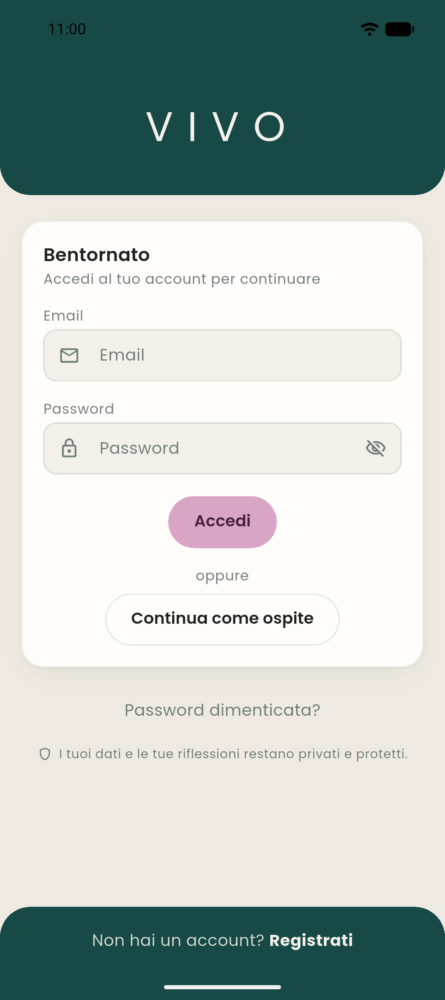
  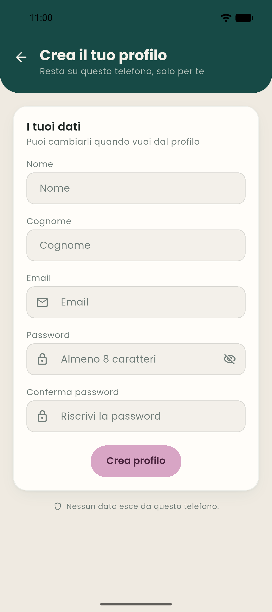

<em>Figura 30 - Accesso e creazione del profilo nell'applicazione realizzata</em>

La schermata principale saluta l'utente per nome e riporta la data per esteso. Il pulsante di aiuto è collocato a cavallo fra l'intestazione e il corpo, in una posizione che lo rende il primo elemento raggiunto dallo sguardo senza per questo occupare l'intera schermata. Sotto di esso trovano posto la registrazione dell'umore quotidiano, le due attività avviabili in autonomia e la card dei progressi, che confronta il numero di richieste della settimana corrente con quello della settimana precedente e ne dichiara la variazione percentuale (**REQ-06**, **REQ-08**, **REQ-09**).

  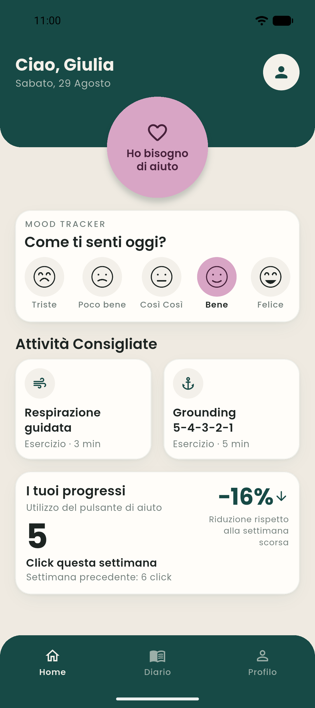

<em>Figura 31 - La schermata principale dell'applicazione realizzata</em>

Il percorso di aiuto si apre con la schermata di transizione, priva di comandi e di barre, che introduce la sessione con una frase e si esaurisce da sola dopo pochi secondi. Le tre attività che seguono condividono la stessa cornice, composta dall'indicatore a tre passi in cima, dal titolo dell'esercizio con la relativa istruzione e dal comando di uscita esplicito. La barra di navigazione inferiore, come stabilito dalla valutazione, non compare in nessuna di queste schermate (**REQ-03**).

  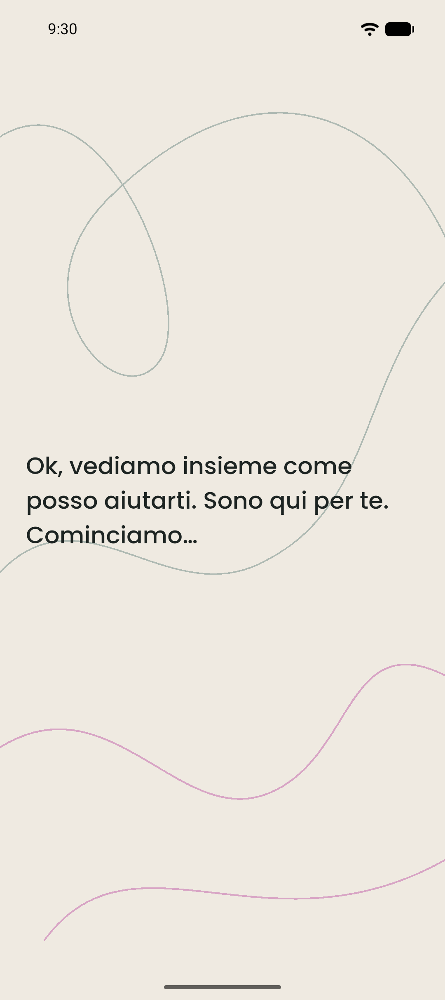
  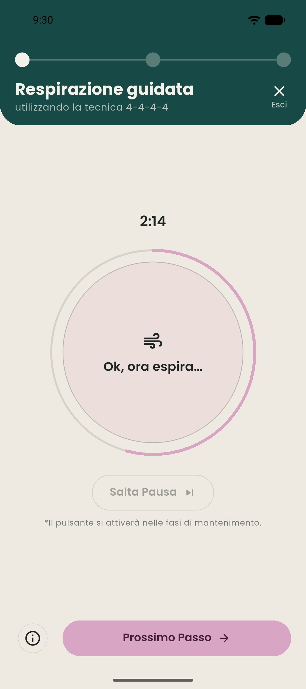
  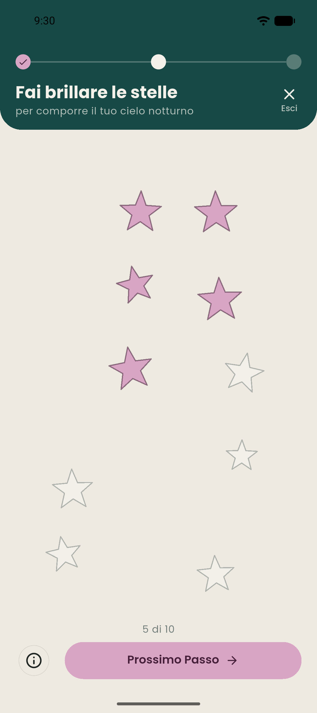

<em>Figura 32 - La transizione, la respirazione guidata e l'attività delle stelle</em>

La respirazione guidata mostra il tempo rimanente, un anello che avanza lungo il ciclo e un cerchio che si espande e si contrae accompagnando le fasi, con l'istruzione scritta al centro. Il comando che salta le pause di mantenimento è stato reso esplicito dopo il test, e resta visibile ma inattivo fuori da quelle fasi, accompagnato da una riga che ne dichiara la condizione di attivazione, cosicché l'utente non lo cerchi invano né lo prema senza effetto. L'attività delle stelle presenta un cielo di sagome da riempire con il tocco e un contatore che indica quante ne sono state accese, senza punteggi né tempi da rispettare. Il grounding si sviluppa come una sequenza verticale in cui il passo corrente è pienamente leggibile mentre quelli successivi restano accennati, e si rivelano soltanto procedendo, per non mettere davanti agli occhi di chi è in difficoltà l'intero compito in una volta sola.

  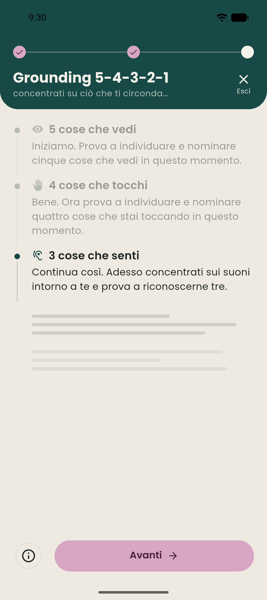
  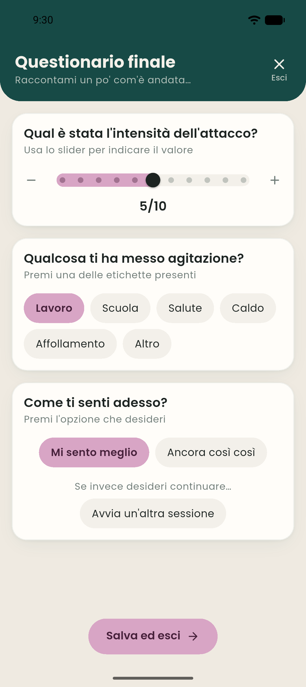

<em>Figura 33 - Il grounding 5-4-3-2-1 e il questionario di chiusura</em>

Il questionario conclusivo raccoglie in tre card l'intensità dichiarata su una scala da zero a dieci, il fattore scatenante scelto fra etichette già pronte fra cui compare quella generica, e lo stato dell'utente al termine della sessione. A quest'ultima domanda è affiancata la possibilità di avviare immediatamente un altro percorso, per il caso in cui il primo non sia bastato. L'intestazione conserva il comando di uscita, e il pulsante conclusivo dichiara nel proprio testo che il salvataggio coincide con l'uscita (**REQ-06**).

Il diario si apre su un calendario mensile in cui i giorni che contengono registrazioni sono contrassegnati da un punto, così che lo storico si attraversi senza scorrere elenchi (**REQ-07**). Sotto il calendario, la giornata selezionata è riassunta dall'umore registrato e dalla card delle richieste di aiuto, che riporta per ciascun episodio il numero progressivo, l'orario e l'intensità. Il riquadro di dettaglio, adottato nella forma scelta dagli utenti, raccoglie tutti gli episodi della giornata in un unico blocco e affianca a ogni valore una barra proporzionale e il fattore scatenante. La riflessione della giornata occupa la parte inferiore della schermata e si apre in un riquadro dedicato alla sola scrittura, modificabile anche in un momento successivo (**REQ-10**).

  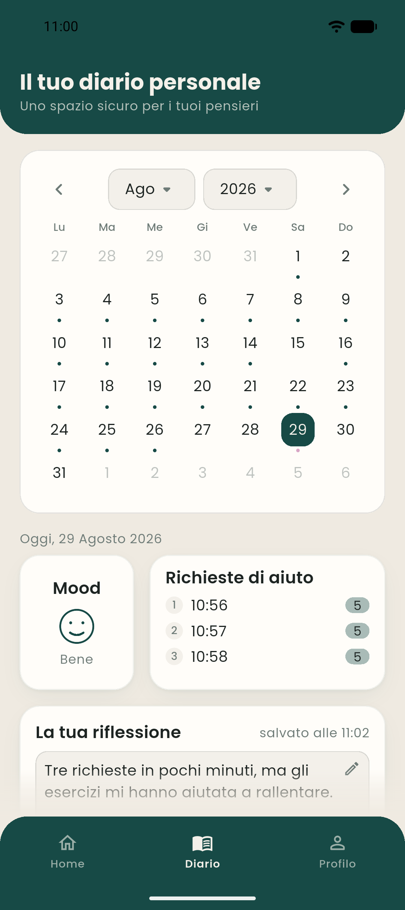
  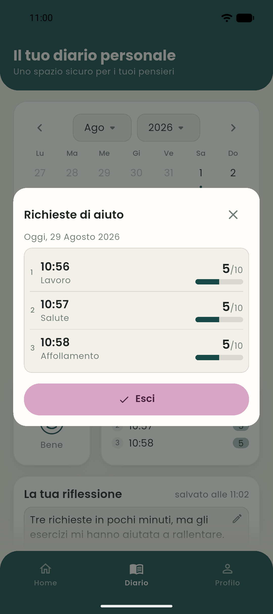
  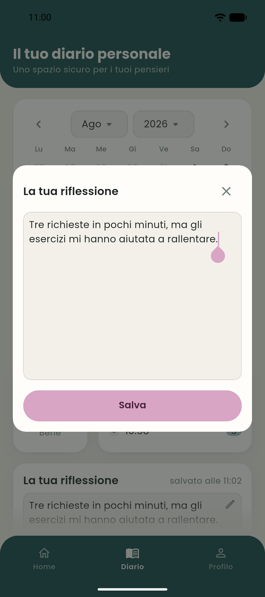

<em>Figura 34 - Il diario, il dettaglio delle richieste di aiuto e la riflessione personale</em>

Il profilo raccoglie nella prima card i dati personali, con l'immagine scelta dalla galleria o dalla fotocamera, e nella seconda le impostazioni, dove l'interruttore del promemoria è affiancato dal cambio della password e dalla disconnessione (**REQ-11**). L'eliminazione dell'account resta isolata in fondo alla schermata, con un trattamento visivo che ne abbassa deliberatamente il peso rispetto alle azioni ordinarie, e la cancellazione rimuove dal dispositivo l'intero archivio dell'utente (**REQ-05**).

  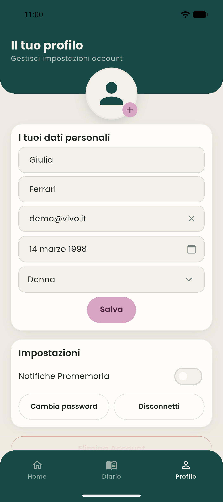

<em>Figura 35 - Il profilo dell'applicazione realizzata</em>

### 6.3 Differenze rispetto alla progettazione

Lo sviluppo ha confermato l'architettura definita nei wireframe, ma alcune scelte sono state riviste nel passaggio all'applicazione funzionante. Il confronto è stato condotto schermata per schermata, ridisegnando ciascuna interfaccia dal codice sulle misure del wireframe corrispondente e mettendo le due immagini a fianco. Di seguito sono riportate le differenze che cambiano il modo in cui l'applicazione si usa, mentre gli scarti di sola resa tipografica, come il corpo di un testo o il centraggio verticale di un blocco, non compaiono nell'elenco perché non incidono su ciò che l'utente può fare.

**L'intensità nella card del diario.** Il wireframe scelto dagli utenti affidava l'intensità a una pastiglia riempita per una lunghezza proporzionale al valore. Nell'applicazione la pastiglia resta, ma è la sua tinta a farsi più carica quanto più l'intensità è alta, mentre il riempimento proporzionale è stato spostato nel riquadro di dettaglio, dove ogni episodio dispone della larghezza intera e la barra si legge accanto al fattore scatenante. Il risultato cercato dal test non cambia, poiché scorrendo l'elenco la giornata si legge prima dei numeri, ma la forma dell'indicatore non è quella valutata e va dichiarata (**REQ-07**).

**Il contatore delle stelle.** Né lo sketch né il wireframe indicavano quante stelle fossero già state accese, e il cielo si presentava come un compito senza misura. L'applicazione riporta il conteggio sotto le sagome, nella forma "5 di 10", che restituisce il progresso senza trasformarlo in una condizione da soddisfare, dal momento che il passaggio all'attività successiva resta disponibile in qualsiasi momento (**REQ-03**).

**Il comando della riflessione.** Lo sketch dichiarava insieme il salvataggio e l'uscita con la formula "Salva ed esci". Nel wireframe e nell'applicazione il comando si riduce alla sola parola "Salva", poiché il riquadro si chiude riportando al diario, che resta visibile dietro di esso per tutto il tempo della scrittura.

**Il velo dei riquadri del diario copre anche la barra di navigazione.** Nel wireframe la barra in fondo resta illuminata mentre il riquadro della riflessione è aperto, e quindi raggiungibile durante la scrittura. Nell'applicazione il velo la copre insieme al resto della schermata, e un tocco fuori dal riquadro lo chiude anziché cambiare scheda. Una barra attiva accanto a un testo non ancora salvato è la stessa via d'uscita involontaria che la valutazione aveva rilevato nel percorso di aiuto, e la soluzione adottata è la medesima (**REQ-03**).

**Il saluto della schermata principale è fisso.** Il wireframe mostra un saluto legato all'ora del giorno, del tipo "Buongiorno", mentre l'applicazione scrive sempre "Ciao" seguito dal nome. Con un nome reale accanto, la formula contestuale mandava il saluto su due righe dell'intestazione, e la riga in più costava alla schermata più di quanto il saluto aggiungesse.

**Il calendario del diario comincia di lunedì.** Il wireframe disegnava la settimana a partire da domenica. La settimana che inizia di lunedì è la convenzione in uso in Italia ed è la stessa adottata dal calcolo dell'andamento settimanale (**REQ-09**), cosicché il conteggio dei progressi e le colonne del calendario si riferiscano allo stesso periodo.

**La dimensione del carattere.** Quest'ultima voce non è uno scostamento dal disegno, che sul punto non diceva nulla, ma una scelta dello sviluppo che va dichiarata. L'applicazione impiega la propria scala tipografica e ignora la dimensione del carattere impostata nel telefono. La scelta preserva i layout valutati con gli utenti, che con i corpi di testo più grandi manderebbero a capo i titoli delle card, ma costituisce anche un limite di accessibilità dichiarato, ripreso fra gli sviluppi futuri.

Una parola infine sul modo in cui il confronto è stato condotto. Non tutte le differenze rilevate sono state accettate a tavolino: quella relativa allo stacco fra il pannello del logo e la card nella schermata di accesso, che nel disegno è più ampio di quanto l'applicazione mostri, è stata corretta davvero, ricostruendo il pacchetto e installandolo per osservare le due versioni sul dispositivo. A confronto diretto, e persino ingrandendo le immagini, la modifica non risultava distinguibile, e per questo è stata annullata. Una differenza che nessuno percepisce non giustifica un intervento sulla prima schermata dell'applicazione.

## 7. Conclusioni

Il percorso descritto in questo documento ha condotto Vivo dall'idea iniziale a un'applicazione installabile, attraversando nell'ordine la definizione della vision, l'analisi dei competitor, la stesura dei requisiti, l'esplorazione con gli sketch, la modellazione dei wireframe, la valutazione con gli utenti e infine lo sviluppo. Ogni fase ha vincolato quella successiva, e nessuna delle scelte finali è priva di una motivazione rintracciabile in un punto preciso del processo.

L'analisi dei competitor ha individuato una lacuna precisa, ovvero che le applicazioni esaminate rispondono alla crisi con contenuti da leggere o da ascoltare anziché con qualcosa da fare, e che l'accesso agli strumenti è ostacolato da procedure di registrazione e da paywall collocati esattamente nel punto in cui l'utente ha bisogno di aiuto. I requisiti sono stati scritti a partire da questa constatazione, e la tabella seguente riepiloga il modo in cui ciascuno di essi è stato soddisfatto nell'applicazione realizzata.

| Requisito | Realizzazione |
| --- | --- |
| REQ-01 | Interfaccia a card su fondo chiaro, pulsante di aiuto in rosa anziché in rosso, nessun contenuto estraneo nella schermata principale |
| REQ-02 | Tre esercizi interattivi nel percorso di soccorso, ovvero respirazione 4-4-4-4, attività delle stelle e grounding 5-4-3-2-1 |
| REQ-03 | Comando di uscita esplicito in ogni schermata del percorso, con dichiarazione delle conseguenze, e barra di navigazione rimossa dal flusso dopo la valutazione |
| REQ-04 | Accesso come ospite in evidenza nella schermata iniziale, nessuna configurazione preliminare e nessun pagamento |
| REQ-05 | Database SQLite nella cartella privata dell'applicazione, password conservata come impronta con sale, eliminazione dell'account dal profilo |
| REQ-06 | Registrazione dell'umore nella schermata principale e questionario di chiusura con intensità e fattore scatenante |
| REQ-07 | Diario con calendario mensile, giorni contrassegnati e vista di dettaglio delle richieste |
| REQ-08 | Respirazione e grounding avviabili singolarmente dalle attività consigliate |
| REQ-09 | Card dei progressi con confronto fra la settimana corrente e la precedente e variazione percentuale |
| REQ-10 | Riflessione libera legata alla giornata, riapribile e modificabile in un momento successivo |
| REQ-11 | Profilo con dati anagrafici e immagine, modificabili in qualsiasi momento, con cambio della password e disconnessione |
| REQ-12 | Promemoria quotidiano a un orario scelto dall'utente, disattivabile dal profilo |

Il contributo più istruttivo è venuto dalla valutazione con gli utenti, e non perché abbia smentito l'impostazione generale, che anzi ha retto. Il rilievo sulla barra di navigazione ha mostrato che un elemento corretto in astratto, mantenuto per uniformità con il resto dell'applicazione, può diventare dannoso in un contesto specifico, e che la reversibilità richiesta dal requisito non consiste nel moltiplicare le uscite ma nel renderne consapevole chi le imbocca. Allo stesso modo, il confronto sulla card del diario ha mostrato che un'informazione in più, il fattore scatenante esposto nella vista compatta, peggiora la lettura anziché arricchirla quando occupa lo spazio destinato a un'occhiata rapida.

Resta il limite dichiarato nel capitolo della valutazione. Nessuna prova ha potuto svolgersi durante un attacco di panico reale, che è il contesto per cui l'applicazione è stata progettata, e le osservazioni raccolte a mente lucida vanno lette come una condizione più favorevole di quella d'uso.

### 7.1 Sviluppi futuri

Il primo sviluppo riguarda l'accessibilità, sulla quale l'applicazione lascia scoperti due interventi, ovvero le etichette semantiche destinate ai lettori di schermo e l'adattamento ai corpi di testo maggiori, dal momento che Vivo impiega una scala tipografica propria e ignora la dimensione del carattere scelta nel telefono. È una scelta che protegge i layout ma esclude chi quella dimensione l'ha aumentata per necessità, ed è l'intervento con l'impatto più ampio fra quelli elencati qui.

Il secondo riguarda la restituzione dei dati raccolti. Il diario conserva già intensità e fattori scatenanti di ogni episodio, ma l'applicazione non ne ricava ancora una lettura d'insieme. Mostrare quali fattori ricorrono con maggiore frequenza, o in quali fasce orarie si concentrano le richieste, trasformerebbe un archivio in uno strumento di consapevolezza, che è l'obiettivo dichiarato del tracciamento.

Il terzo nasce dal profilo del secondo utente descritto fra le personas, ovvero chi segue un percorso psicoterapeutico. Una funzione di esportazione del periodo selezionato, in un formato leggibile e prodotta su richiesta esplicita, permetterebbe di portare in seduta ciò che è stato annotato, senza per questo contraddire il principio di conservazione locale, poiché il file resterebbe nelle mani dell'utente.

Restano infine tre estensioni di minore portata ma di sicura utilità, ovvero una scorciatoia raggiungibile dalla schermata di blocco per avviare il percorso di aiuto senza aprire l'applicazione, un salvataggio di riserva cifrato e protetto da password per non perdere il diario cambiando telefono, e la disponibilità di contenuti audio per chi preferisce essere guidato dalla voce anziché dal testo, esclusa in questa versione perché richiederebbe una voce registrata e non sarebbe utilizzabile in luogo pubblico senza cuffie.
